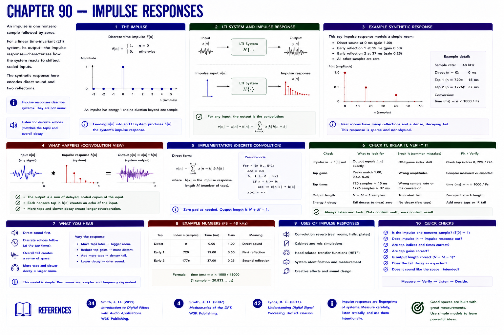

# Chapter 90 — Impulse Responses



## Hear → see → describe

An impulse is one nonzero sample followed by zeros. For a linear time-invariant system, its output—the impulse response—characterizes how the system reacts to shifted, scaled inputs. The synthetic response here encodes direct sound and two reflections.

## Implement, break, debug, verify

Plot the response, source, and output in `impulse-convolution.svg`. Check reflection indices in samples and convert them to milliseconds with the sample rate.

```bash
python examples/part_07_dsp.py
pytest -q tests/test_dsp.py
```

## References

- Smith, Julius O., *Introduction to Digital Filters with Audio Applications* [bibliography entry 34](../../references/bibliography.md#34).
- Smith, Julius O., *Mathematics of the DFT* [bibliography entry 4](../../references/bibliography.md).
- Lyons, Richard G., *Understanding Digital Signal Processing*, 3rd ed. [bibliography entry 42](../../references/bibliography.md#42).
