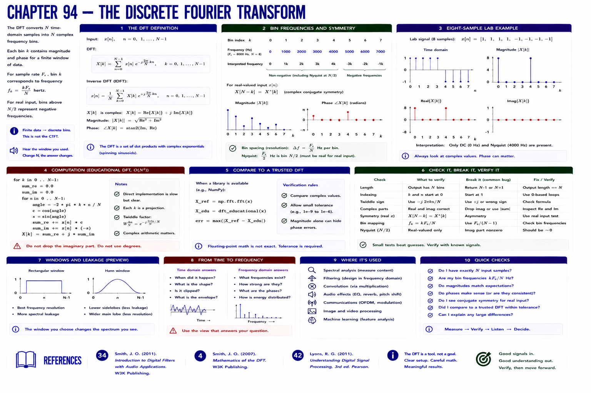

# Chapter 94 — The Discrete Fourier Transform



## Hear → see → describe

The DFT projects `N` input samples onto `N` complex frequency bins. Each complex result contains magnitude and phase for a finite observation window. Bin `k` corresponds to `k sample_rate/N` hertz under this simple mapping; negative-frequency bins occupy the upper half for real input.

## Implement, break, debug, verify

Compute the eight-sample lab with the educational O(N²) implementation. Compare complex values, not only magnitude, with a trusted library DFT when installed. Tolerance is required for floating point.

```bash
python examples/part_07_dsp.py
pytest -q tests/test_dsp.py
```

## References

- Smith, Julius O., *Introduction to Digital Filters with Audio Applications* [bibliography entry 34](../../references/bibliography.md#34).
- Smith, Julius O., *Mathematics of the DFT* [bibliography entry 4](../../references/bibliography.md).
- Lyons, Richard G., *Understanding Digital Signal Processing*, 3rd ed. [bibliography entry 42](../../references/bibliography.md#42).
