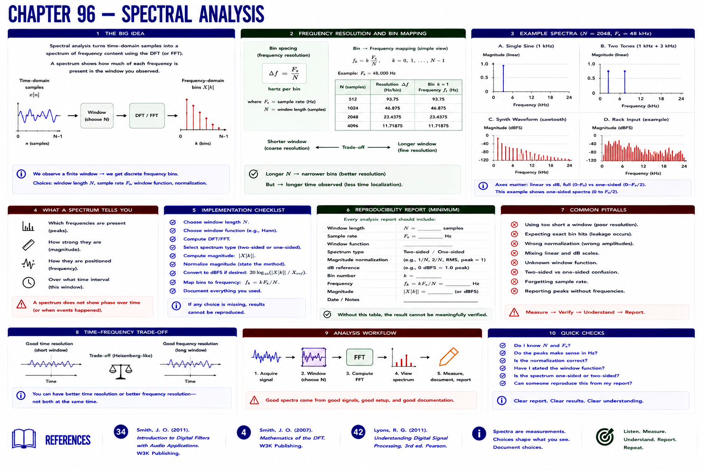

# Chapter 96 — Spectral Analysis



## Hear → see → describe

A spectrum displays DFT bins. With an `N`-sample window, simple bin spacing is `frequency_resolution = sample_rate / N`: hertz equals samples/second divided by samples. Longer windows narrow bin spacing but observe more time.

## Implement, break, debug, verify

Analyze a sine, two-tone signal, synth waveform, and generated rack input. Report window, rate, bin number, frequency, and magnitude normalization; otherwise the result cannot be reproduced.

```bash
python examples/part_07_dsp.py
pytest -q tests/test_dsp.py
```

## References

- Smith, Julius O., *Introduction to Digital Filters with Audio Applications* [bibliography entry 34](../../references/bibliography.md#34).
- Smith, Julius O., *Mathematics of the DFT* [bibliography entry 4](../../references/bibliography.md).
- Lyons, Richard G., *Understanding Digital Signal Processing*, 3rd ed. [bibliography entry 42](../../references/bibliography.md#42).
