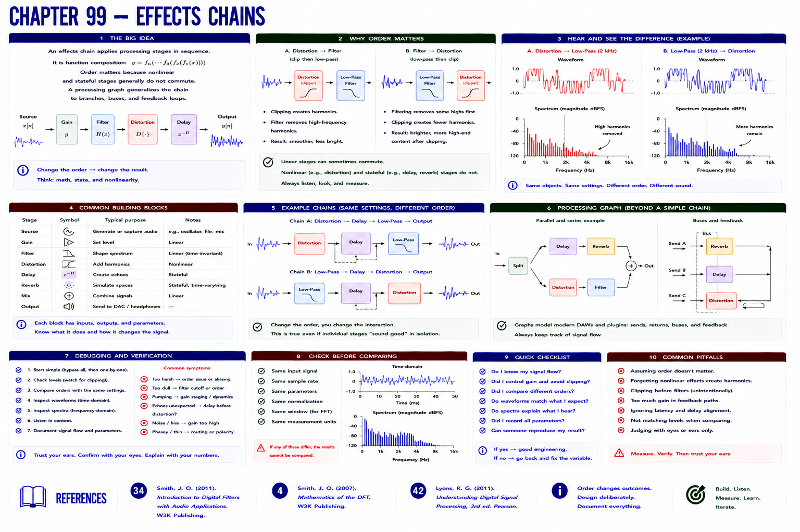

# Chapter 99 — Effects Chains



## Hear → see → describe

An effects chain is function composition: source → gain → filter → distortion → delay → output. Order matters because nonlinear and stateful stages generally do not commute. A processing graph generalizes the chain to branches and buses.

## Implement, break, debug, verify

Compare distortion → filter with filter → distortion using identical parameters; inspect waveforms and spectra. The rack configuration records order explicitly, connecting to Part III tracks and Part IV routing/plugins.

```bash
python examples/part_07_dsp.py
pytest -q tests/test_dsp.py
```

## References

- Smith, Julius O., *Introduction to Digital Filters with Audio Applications* [bibliography entry 34](../../references/bibliography.md#34).
- Smith, Julius O., *Mathematics of the DFT* [bibliography entry 4](../../references/bibliography.md).
- Lyons, Richard G., *Understanding Digital Signal Processing*, 3rd ed. [bibliography entry 42](../../references/bibliography.md#42).
