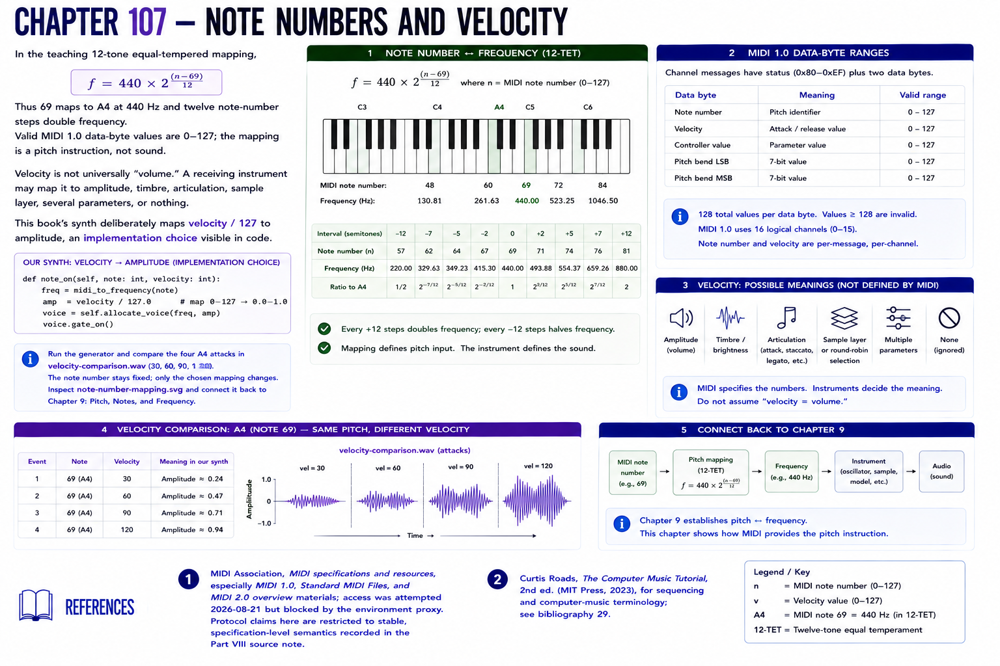

# Chapter 107 — Note Numbers and Velocity

In the teaching 12-tone equal-tempered mapping, `f = 440 × 2^((n−69)/12)`. Thus 69 maps to A4 at 440 Hz and twelve note-number steps double frequency. Valid MIDI 1.0 data-byte values are 0–127; the mapping is a pitch instruction, not sound.

Velocity is not universally “volume.” A receiving instrument may map it to amplitude, timbre, articulation, sample layer, several parameters, or nothing. This book's synth deliberately maps `velocity / 127` to amplitude, an **implementation choice** visible in code.

Run the generator and compare the four A4 attacks in `velocity-comparison.wav` (30, 60, 90, 120). The note number stays fixed; only the chosen mapping changes. Inspect `note-number-mapping.svg` and connect it back to [Chapter 9](../part-02-music-fundamentals/09-pitch-notes-and-frequency.md).

## References

- MIDI Association, [MIDI specifications and resources](https://midi.org/specs), especially MIDI 1.0, Standard MIDI Files, and MIDI 2.0 overview materials; access was attempted 2026-08-21 but blocked by the environment proxy. Protocol claims here are restricted to stable, specification-level semantics recorded in the [Part VIII source note](../../references/source-notes/part-08.md).
- Curtis Roads, *The Computer Music Tutorial*, 2nd ed. (MIT Press, 2023), for sequencing and computer-music terminology; see [bibliography 29](../../references/bibliography.md#29).
