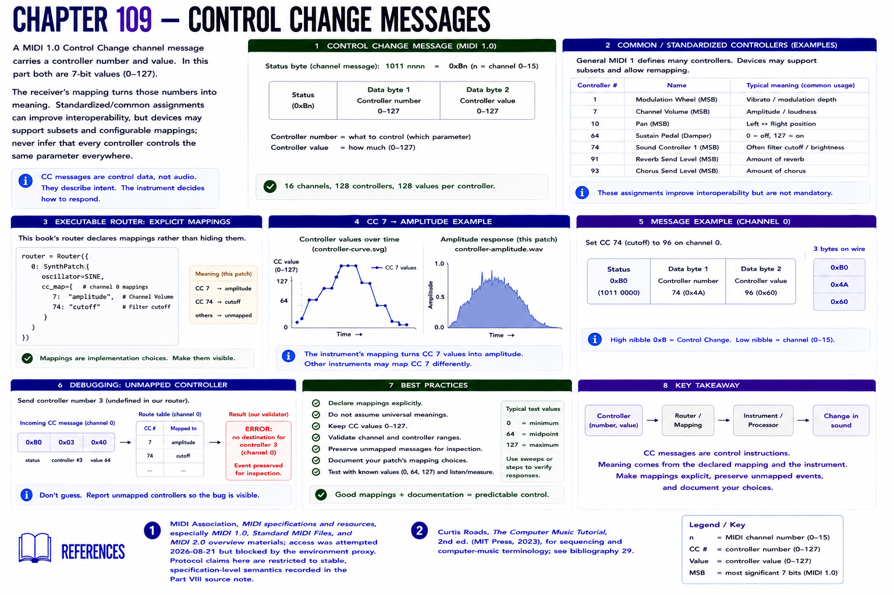

# Chapter 109 — Control Change Messages

A MIDI 1.0 **Control Change** channel message carries a controller number and value. In this part both are 7-bit values (0–127). The receiver's mapping turns those numbers into meaning. Standardized/common assignments can improve interoperability, but devices may support subsets and configurable mappings; never infer that every controller controls the same parameter everywhere.

The executable router declares mappings rather than hiding them: CC 7 → educational patch amplitude and CC 74 → cutoff. `controller-curve.svg` plots the source values; `controller-amplitude.wav` renders the chosen amplitude response. The CC values are control data, not an audio envelope.

**Debugging.** Send controller 3 without a declared mapping. Preserve the event and inspect the route table; the readable error is better than silently discarding or remapping it.

## References

- MIDI Association, [MIDI specifications and resources](https://midi.org/specs), especially MIDI 1.0, Standard MIDI Files, and MIDI 2.0 overview materials; access was attempted 2026-08-21 but blocked by the environment proxy. Protocol claims here are restricted to stable, specification-level semantics recorded in the [Part VIII source note](../../references/source-notes/part-08.md).
- Curtis Roads, *The Computer Music Tutorial*, 2nd ed. (MIT Press, 2023), for sequencing and computer-music terminology; see [bibliography 29](../../references/bibliography.md#29).
