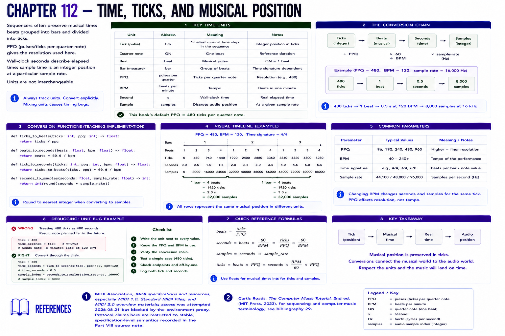

# Chapter 112 — Time, Ticks, and Musical Position



Sequencers often preserve **musical time**: beats grouped into bars and divided into ticks. PPQ (pulses/ticks per quarter note) gives the resolution used here. Wall-clock seconds describe elapsed time; sample time is an integer position at a particular sample rate. Units are not interchangeable.

```text
ticks ÷ PPQ → beats × 60/BPM → seconds × sample-rate → samples
480 ticks → 1 beat → 0.5 s at 120 BPM → 8,000 samples at 16 kHz
```

`ticks_to_beats`, `beats_to_seconds`, `tick_to_seconds`, and `seconds_to_samples` expose every conversion. `ticks-beats-time.svg` uses the same data. **Debugging:** treating 480 ticks as 480 seconds is a unit bug. Write units beside values and assert the simple chain above before investigating synthesis.

## References

- MIDI Association, [MIDI specifications and resources](https://midi.org/specs), especially MIDI 1.0, Standard MIDI Files, and MIDI 2.0 overview materials; access was attempted 2026-08-21 but blocked by the environment proxy. Protocol claims here are restricted to stable, specification-level semantics recorded in the [Part VIII source note](../../references/source-notes/part-08.md).
- Curtis Roads, *The Computer Music Tutorial*, 2nd ed. (MIT Press, 2023), for sequencing and computer-music terminology; see [bibliography 29](../../references/bibliography.md#29).
