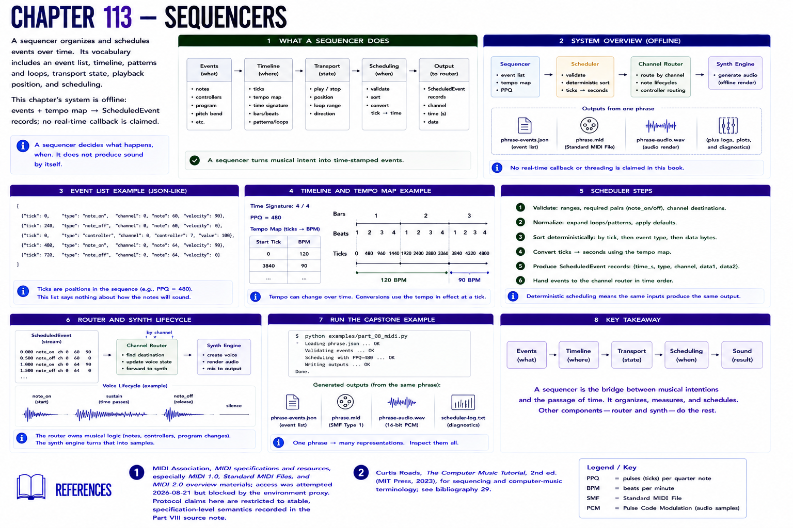

# Chapter 113 — Sequencers

A **sequencer** organizes and schedules events over time. Its vocabulary includes an event list, timeline, patterns and loops, transport state, playback position, and scheduling. This chapter's system is offline: `events + tempo map → ScheduledEvent` records; no real-time callback is claimed.

The scheduler validates, sorts deterministically, converts ticks through the tempo map, and passes events to a channel router. The router creates synth note lifecycles and generates audio. This extends the event lists of [Part III](../part-03-building-electronic-music/README.md) and the track/timeline model of [Part IV](../part-04-the-digital-audio-workstation/README.md). Run `examples/part_08_midi.py`; `phrase-events.json`, `phrase.mid`, and the patch renders are multiple outputs from one phrase.

## References

- MIDI Association, [MIDI specifications and resources](https://midi.org/specs), especially MIDI 1.0, Standard MIDI Files, and MIDI 2.0 overview materials; access was attempted 2026-08-21 but blocked by the environment proxy. Protocol claims here are restricted to stable, specification-level semantics recorded in the [Part VIII source note](../../references/source-notes/part-08.md).
- Curtis Roads, *The Computer Music Tutorial*, 2nd ed. (MIT Press, 2023), for sequencing and computer-music terminology; see [bibliography 29](../../references/bibliography.md#29).
