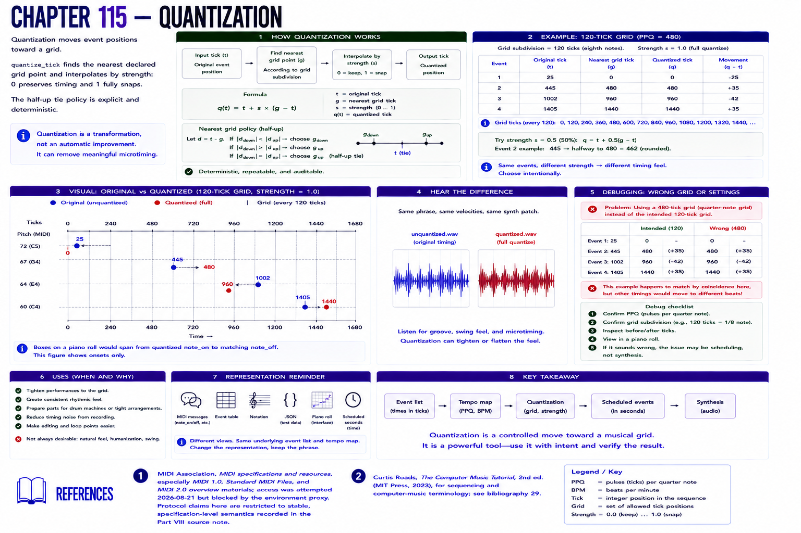

# Chapter 115 — Quantization

Quantization moves event positions toward a grid. `quantize_tick` finds the nearest declared grid point and interpolates by `strength`: 0 preserves timing and 1 fully snaps. The half-up tie policy is explicit and deterministic.

The generator starts at ticks 25, 445, 1002, and 1405, produces full 120-tick-grid positions, plots both in `quantization.svg`, and renders `unquantized.wav` and `quantized.wav`. Quantization is a transformation, not an automatic improvement: it can remove meaningful microtiming.

**Debugging.** A 480-tick grid when 120 was intended can move attacks to another beat. Inspect PPQ, subdivision, before/after ticks, and a piano roll; do not debug the synth for a scheduling error.

## References

- MIDI Association, [MIDI specifications and resources](https://midi.org/specs), especially MIDI 1.0, Standard MIDI Files, and MIDI 2.0 overview materials; access was attempted 2026-08-21 but blocked by the environment proxy. Protocol claims here are restricted to stable, specification-level semantics recorded in the [Part VIII source note](../../references/source-notes/part-08.md).
- Curtis Roads, *The Computer Music Tutorial*, 2nd ed. (MIT Press, 2023), for sequencing and computer-music terminology; see [bibliography 29](../../references/bibliography.md#29).
