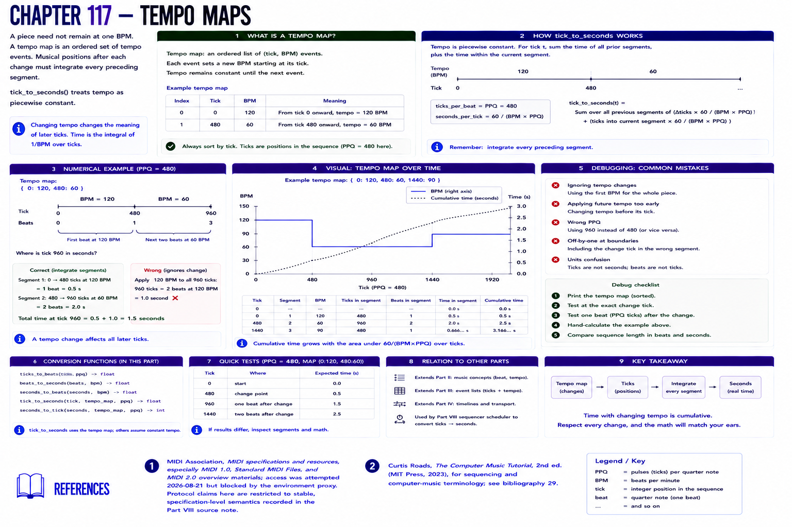

# Chapter 117 — Tempo Maps

A piece need not remain at one BPM. A **tempo map** is an ordered set of tempo events; musical positions after each change must integrate every preceding segment. `tick_to_seconds` treats tempo as piecewise constant.

At PPQ 480, tick 960 under `{0:120, 480:60}` occurs after 0.5 seconds for the first beat plus 1 second for the second: 1.5 seconds. `tempo-map.svg` plots a short change. **Debugging:** applying the initial 120 BPM to all 960 ticks gives 1.0 second. Test at the boundary and one beat after it.

## References

- MIDI Association, [MIDI specifications and resources](https://midi.org/specs), especially MIDI 1.0, Standard MIDI Files, and MIDI 2.0 overview materials; access was attempted 2026-08-21 but blocked by the environment proxy. Protocol claims here are restricted to stable, specification-level semantics recorded in the [Part VIII source note](../../references/source-notes/part-08.md).
- Curtis Roads, *The Computer Music Tutorial*, 2nd ed. (MIT Press, 2023), for sequencing and computer-music terminology; see [bibliography 29](../../references/bibliography.md#29).
