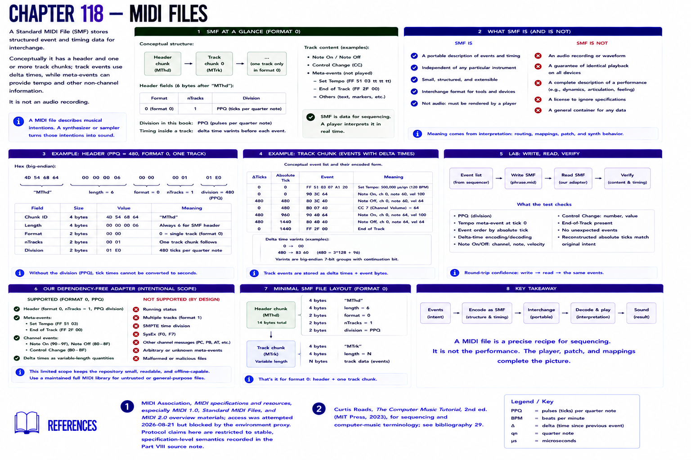

# Chapter 118 — MIDI Files

A **Standard MIDI File** stores structured event and timing data for interchange. Conceptually it has a header and one or more track chunks; track events use delta times, while meta-events can provide tempo and other non-channel information. It is not an audio recording.

The lab writes `phrase.mid`, reloads it in the automated test, and verifies ticks, types, channels, notes, velocities, and CC data. The dependency-free adapter is intentionally limited to SMF format 0, PPQ division, one tempo meta-event, note messages, CC, and end-of-track. It is pedagogically justified so the repository runs offline; it is **not a general parser** (no running status, SMPTE division, SysEx, or arbitrary meta/channel messages). Use a maintained full MIDI library for untrusted/general files.

## References

- MIDI Association, [MIDI specifications and resources](https://midi.org/specs), especially MIDI 1.0, Standard MIDI Files, and MIDI 2.0 overview materials; access was attempted 2026-08-21 but blocked by the environment proxy. Protocol claims here are restricted to stable, specification-level semantics recorded in the [Part VIII source note](../../references/source-notes/part-08.md).
- Curtis Roads, *The Computer Music Tutorial*, 2nd ed. (MIT Press, 2023), for sequencing and computer-music terminology; see [bibliography 29](../../references/bibliography.md#29).
