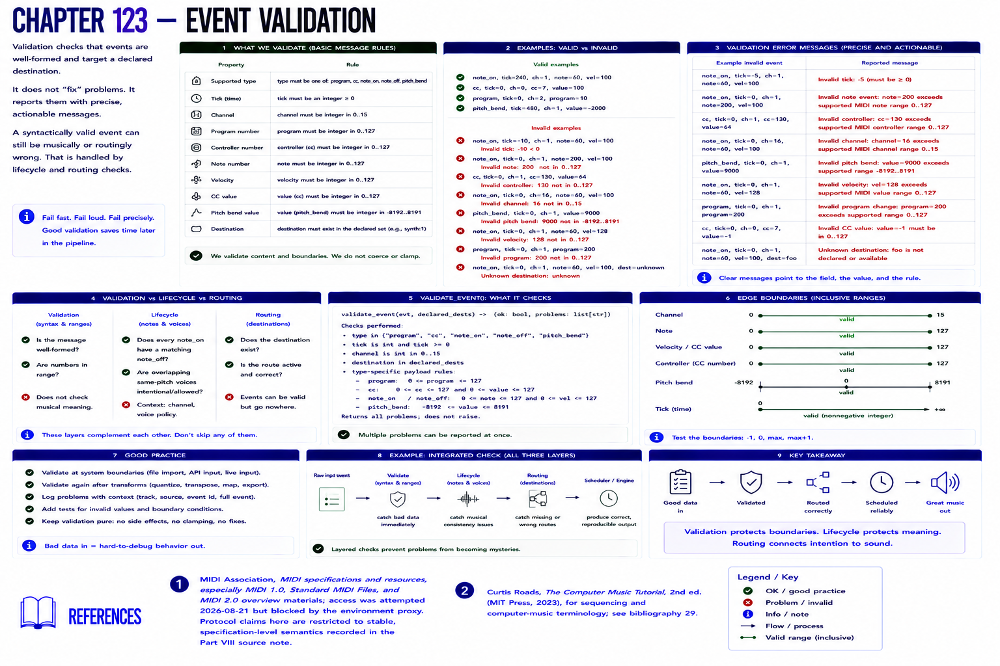

# Chapter 123 — Event Validation



Validation checks supported event type, nonnegative ticks, channel 0–15, note/velocity/controller/value data 0–127, signed pitch-bend range, and declared destination. It reports rather than clamps.

```text
Invalid note event: note=200 exceeds supported MIDI note range 0..127
```

`validate_event` validates messages; lifecycle and routing add contextual checks such as a matching note-off and destination. This separation matters: a syntactically valid note can still be musically/routingly wrong. Add tests for invalid boundaries instead of assuming malformed values will become harmless.

## References

- MIDI Association, [MIDI specifications and resources](https://midi.org/specs), especially MIDI 1.0, Standard MIDI Files, and MIDI 2.0 overview materials; access was attempted 2026-08-21 but blocked by the environment proxy. Protocol claims here are restricted to stable, specification-level semantics recorded in the [Part VIII source note](../../references/source-notes/part-08.md).
- Curtis Roads, *The Computer Music Tutorial*, 2nd ed. (MIT Press, 2023), for sequencing and computer-music terminology; see [bibliography 29](../../references/bibliography.md#29).
