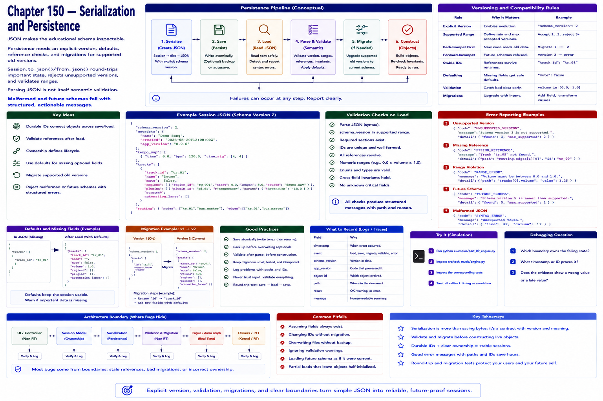

# Chapter 150 — Serialization and Persistence

JSON makes the educational schema inspectable. Persistence needs an explicit version, defaults, reference checks, and migrations for supported old versions. `Session.to_json/from_json` round-trips important state, rejects unsupported versions, and validates ranges. Parsing JSON is not itself semantic validation.

Malformed and future schemas fail with structured, actionable messages.

## Try it

Run `python examples/part_09_engine.py`; inspect `src/tech_music/engine.py` and the corresponding tests. Treat all callback timing as simulation.

## Debugging question

Which boundary owns the failing state, what timestamp or ID proves it, and does the evidence show a wrong value or a late value?

## References

- JACK Audio Connection Kit, [Client callbacks / process-thread constraints](https://jackaudio.org/api/group__ClientCallbacks.html); retrieval attempted 2026-08-21 (HTTP 403 in build environment).
- PipeWire project, [Overview and graph model](https://docs.pipewire.org/page_overview.html); retrieval attempted 2026-08-21 (HTTP 403 in build environment).
- ALSA project, [PCM interface documentation](https://www.alsa-project.org/alsa-doc/alsa-lib/pcm.html); retrieval attempted 2026-08-21 (HTTP 403 in build environment).
- LV2, [Architecture overview and specification links](https://lv2plug.in/pages/architecture-overview.html); retrieval attempted 2026-08-21 (HTTP 403 in build environment).
- CLAP, [1.x feature overview and specification](https://cleveraudio.org/1-feature-overview/); retrieval attempted 2026-08-21 (HTTP 403 in build environment).
- Ardour Manual, [Development documentation](https://docs.ardour.org/development/); retrieval attempted 2026-08-21 (HTTP 403 in build environment).
- Yoshimi project, [User guide](https://yoshimi.github.io/docs/user-guide/); retrieval attempted 2026-08-21 (HTTP 403 in build environment).
- Robert C. Martin, *Clean Architecture*, Prentice Hall, 2017 (interfaces and boundaries).
