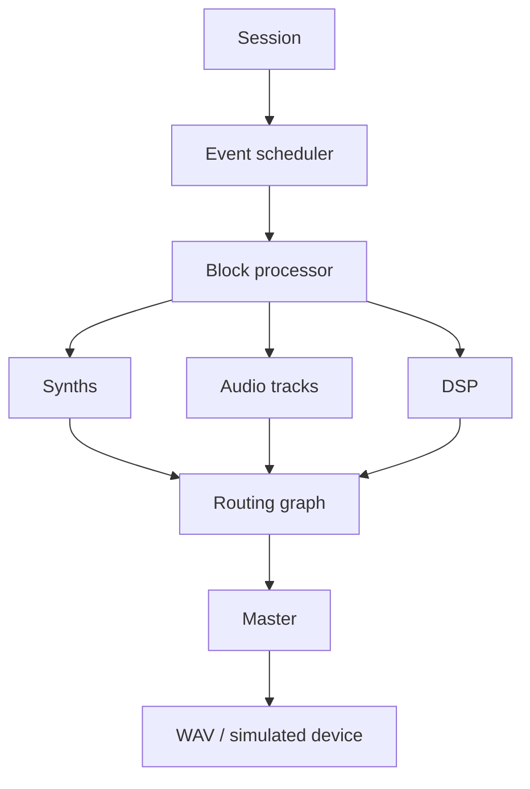

# Part IX — Computer Science of Music

Part IX connects Parts IV–VIII into cooperating software systems. **All “real-time” runs are deadline simulations, not real-time performance claims.** No Part X implementation is included.

## Reading order

1. [The Music Technology Software Stack](125-the-music-technology-software-stack.md)
2. [Offline vs Real-Time Audio Processing](126-offline-vs-real-time-audio-processing.md)
3. [Audio Buffers](127-audio-buffers.md)
4. [Audio Callbacks](128-audio-callbacks.md)
5. [Why Real-Time Audio Is Different](129-why-real-time-audio-is-different.md)
6. [Threads and Concurrency](130-threads-and-concurrency.md)
7. [Synchronization and Shared State](131-synchronization-and-shared-state.md)
8. [Message Passing](132-message-passing.md)
9. [Event Queues and Scheduling](133-event-queues-and-scheduling.md)
10. [Sample-Accurate Scheduling](134-sample-accurate-scheduling.md)
11. [Latency](135-latency.md)
12. [Latency vs CPU Tradeoffs](136-latency-vs-cpu-tradeoffs.md)
13. [Dropouts, Underruns, and Glitches](137-dropouts-underruns-and-glitches.md)
14. [Routing as a Graph](138-routing-as-a-graph.md)
15. [Processing Graph Order](139-processing-graph-order.md)
16. [Feedback and Cycles](140-feedback-and-cycles.md)
17. [Plugin Architecture](141-plugin-architecture.md)
18. [Interfaces and Contracts](142-interfaces-and-contracts.md)
19. [Plugin State and Presets](143-plugin-state-and-presets.md)
20. [Drivers and the Operating System](144-drivers-and-the-operating-system.md)
21. [Linux Audio Architecture](145-linux-audio-architecture.md)
22. [Memory in Audio Software](146-memory-in-audio-software.md)
23. [Circular Buffers](147-circular-buffers.md)
24. [File Streaming](148-file-streaming.md)
25. [Session and Project Architecture](149-session-and-project-architecture.md)
26. [Serialization and Persistence](150-serialization-and-persistence.md)
27. [Undo and Redo](151-undo-and-redo.md)
28. [Determinism and Reproducibility](152-determinism-and-reproducibility.md)
29. [Performance and Profiling](153-performance-and-profiling.md)
30. [Algorithmic Complexity in Music Systems](154-algorithmic-complexity-in-music-systems.md)
31. [Error Handling](155-error-handling.md)
32. [Logging and Diagnostics](156-logging-and-diagnostics.md)
33. [Testing Music Software](157-testing-music-software.md)
34. [Real-Time Testing Challenges](158-real-time-testing-challenges.md)
35. [Debugging the Audio Engine](159-debugging-the-audio-engine.md)
36. [How a DAW Works Under the Hood](160-how-a-daw-works-under-the-hood.md)
37. [How a Software Synthesizer Works Under the Hood](161-how-a-software-synthesizer-works-under-the-hood.md)

## Capstone mental model

The capstone is a deterministic offline sine engine with sample-accurate event application, persistent oscillator phase, graph and session validation, and simulated deadline diagnostics. Continue next with Part X; this part does not begin it.

## Generated artifacts

Run `python examples/part_09_engine.py` to create
`assets/part-09/mini-engine.wav`. Executable examples generate reproducible
audio artifacts locally; those generated binaries are not normally committed.
Small binary fixtures may be versioned only when a test requires source data
that cannot be recreated during the test, and that exception must be documented.

## Platform and evidence boundary

Sources were selected from official project documentation and established texts. URLs and access date (2026-08-21) are recorded per chapter. Network responses were unavailable in the build environment, so current remote contents could not be revalidated; software-specific descriptions are deliberately high-level and must be checked against the linked versioned specifications before publication.
