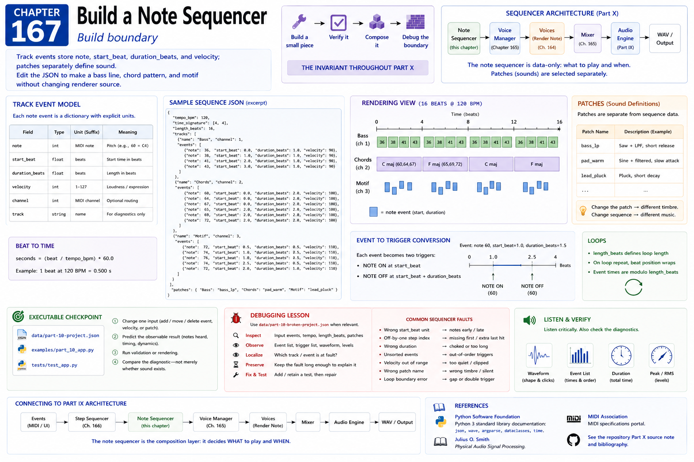

# Chapter 167 — Build a Note Sequencer

## Build boundary

Track events store `note`, `start_beat`, `duration_beats`, and `velocity`; patches separately define sound. Edit the JSON to make a bass line, chord pattern, and motif without changing renderer source.

The invariant throughout Part X is **build a small piece, verify it, compose it, then debug the boundary**. Reuse the executable components in `src/tech_music`; explicit unit suffixes are part of their contracts. This chapter connects earlier music/DSP/event concepts to the Part IX architecture rather than creating a parallel engine.

## Executable checkpoint

Use `data/part-10-project.json`, `examples/part_10_app.py`, and the focused `tests/test_app.py`. Change one input, predict the observable result, run validation or rendering, and compare the diagnostic—not merely whether sound exists.

## Debugging lesson

Use `data/part-10-broken-project.json` when relevant. Inspect input, output, units, ownership, and routing at this boundary. Preserve the fault long enough to explain it, then add or retain a test before repairing it.

## References

- Python Software Foundation, [Python 3 standard library documentation](https://docs.python.org/3/library/), especially `json`, `wave`, `argparse`, `dataclasses`, and `time`.
- Julius O. Smith, [*Physical Audio Signal Processing*](https://ccrma.stanford.edu/~jos/pasp/).
- MIDI Association, [MIDI specifications portal](https://midi.org/specs).
- See the repository [Part X source note](../../references/source-notes/part-10.md) and [bibliography](../../references/bibliography.md).
