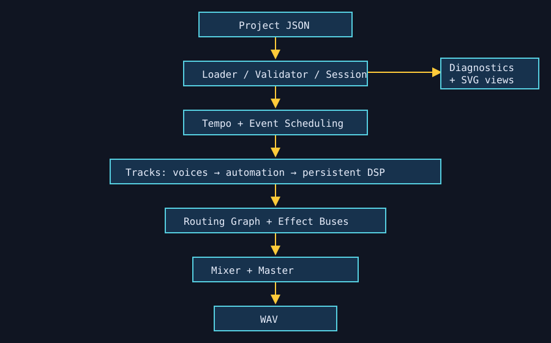

# Part X — Programming Music

Part X is an executable progression: **small function → audio component → synth voice → sequencer → DSP chain → event engine → multi-track system → music application**. Its central rule is: build small pieces, verify them, compose them, and debug boundaries. It reuses Parts II–IX for pitch, arrangement, DAW routing, synthesis, samples, DSP, MIDI events, and architecture. Part XI is only the forward boundary: hardware and operating environments are out of scope here.

## Reading order

1. [Programming Sound from First Principles](162-programming-sound-from-first-principles.md)
2. [Build a Reusable Oscillator](163-build-a-reusable-oscillator.md)
3. [Build a Synth Voice](164-build-a-synth-voice.md)
4. [Build a Polyphonic Synthesizer](165-build-a-polyphonic-synthesizer.md)
5. [Build a Step Sequencer](166-build-a-step-sequencer.md)
6. [Build a Note Sequencer](167-build-a-note-sequencer.md)
7. [Build a Tempo and Timing Engine](168-build-a-tempo-and-timing-engine.md)
8. [Build an Event Scheduler](169-build-an-event-scheduler.md)
9. [Build a Parameter Automation System](170-build-a-parameter-automation-system.md)
10. [Build a DSP Processor Interface](171-build-a-dsp-processor-interface.md)
11. [Build a Gain Processor](172-build-a-gain-processor.md)
12. [Build a Delay Processor](173-build-a-delay-processor.md)
13. [Build a Simple Filter Processor](174-build-a-simple-filter-processor.md)
14. [Build a DSP Chain](175-build-a-dsp-chain.md)
15. [Build an Audio Track](176-build-an-audio-track.md)
16. [Build Multiple Tracks](177-build-multiple-tracks.md)
17. [Build a Mixer](178-build-a-mixer.md)
18. [Build Buses and Routing](179-build-buses-and-routing.md)
19. [Build a Session Model](180-build-a-session-model.md)
20. [Save and Load Projects](181-save-and-load-projects.md)
21. [Build Project Validation](182-build-project-validation.md)
22. [Build a Render Pipeline](183-build-a-render-pipeline.md)
23. [Build Diagnostic Tools](184-build-diagnostic-tools.md)
24. [Build Waveform and Timeline Visualization](185-build-waveform-and-timeline-visualization.md)
25. [Build a Piano Roll](186-build-a-piano-roll.md)
26. [Build a Routing Graph Visualizer](187-build-a-routing-graph-visualizer.md)
27. [Build a Command-Line Music Application](188-build-a-command-line-music-application.md)
28. [Error Messages as Part of the Interface](189-error-messages-as-part-of-the-interface.md)
29. [Configuration vs Code](190-configuration-vs-code.md)
30. [Extending the System Safely](191-extending-the-system-safely.md)
31. [Refactoring Music Software](192-refactoring-music-software.md)
32. [Testing the Complete Pipeline](193-testing-the-complete-pipeline.md)
33. [Regression Testing Audio Software](194-regression-testing-audio-software.md)
34. [Debugging Across Layers](195-debugging-across-layers.md)
35. [Performance Review](196-performance-review.md)
36. [Design Tradeoffs](197-design-tradeoffs.md)
37. [Build a Complete Mini Music Application](198-build-a-complete-mini-music-application.md)

## Run the capstone

```console
python examples/part_10_app.py
tech-music validate data/part-10-project.json
tech-music inspect data/part-10-project.json
tech-music render data/part-10-project.json generated/audio/part-10/boundary-signals.wav
tech-music plot data/part-10-project.json generated/plots/part-10
```

The first command is the complete, verified regeneration workflow. It creates
the capstone WAV under `generated/audio/part-10/`, the arrangement, piano-roll,
waveform, and routing SVGs under `generated/plots/part-10/`, and the diagnostic
report under `generated/reports/part-10/`. The repository ignores the entire
`generated/` tree: these outputs are reproducible results, not source files.
The architecture SVG below remains tracked because it is a hand-authored,
readable source diagram rather than a render produced by the application.

## Architecture



Project JSON flows through loader/validator and the session model into tempo/event scheduling. Independent tracks render voices and persistent DSP blocks; route data orders buses, mixer, master, and WAV. Diagnostics and visualizations read that same model.

## Research boundary

Every chapter records references. Remote research was attempted on 2026-08-21 and returned HTTP 401, so no claim relies on a newly inspected remote page; authoritative targets and the limitation are recorded in the [source note](../../references/source-notes/part-10.md).
