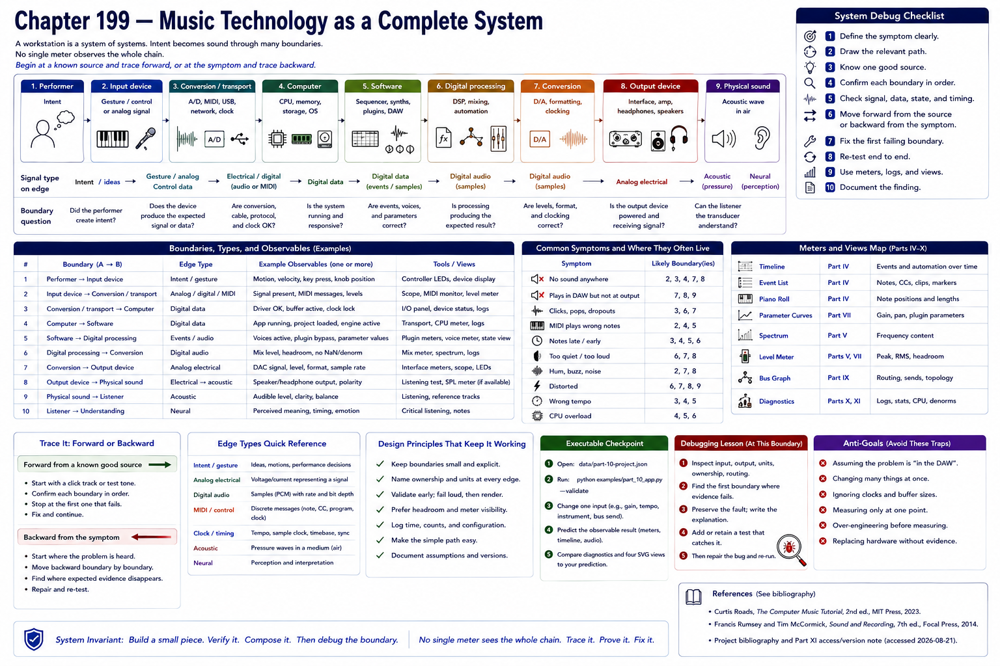

# Chapter 199 — Music Technology as a Complete System

> **Status:** reviewed educational model. Hardware behavior is not probed.

A workstation is a **system of systems**. A performer supplies intent; a device turns it into an event or electrical signal; conversion and transport cross into a computer; software sequences, synthesizes, processes, and mixes; conversion and an output transducer return energy to air and a listener. No single meter observes the whole chain.

**Debug rule:** begin at a known source and trace forward, or at the symptom and trace backward. At every boundary ask whether the expected signal, event, data, state, and timing are present.

## Checkpoint

Draw the relevant path, label every edge by type, and name one observable at each boundary. Connect the result to Parts IV–X rather than treating this layer in isolation.

## References

- Curtis Roads, *The Computer Music Tutorial*, 2nd ed., MIT Press, 2023 (computer-music systems and terminology).
- Francis Rumsey and Tim McCormick, *Sound and Recording*, 7th ed., Focal Press, 2014 (recording, conversion, monitoring, and acoustics).
- [Project bibliography and Part XI access/version note](../../references/bibliography.md#part-xi-sources), accessed or retrieval attempted 2026-08-21.
