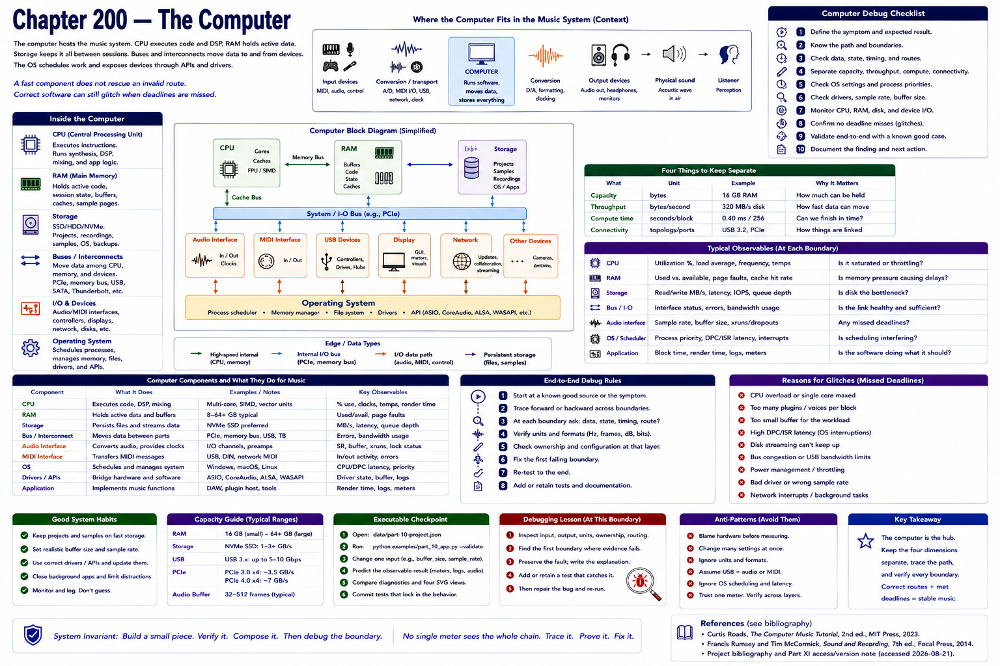

# Chapter 200 — The Computer

> **Status:** reviewed educational model. Hardware behavior is not probed.

The computer hosts the music system. Its **CPU** executes synthesis, DSP, mixing, and application logic. **RAM** holds active code, session state, buffers, caches, and sample pages. **Storage** retains projects, recordings, samples, and backups. Buses move data among CPU, memory, and devices; USB is one peripheral interconnect, not a synonym for audio or MIDI. The operating system schedules processes and exposes devices through APIs and drivers.

A fast component does not rescue an invalid route. Conversely, correct software may glitch when scheduled work misses a real-time deadline. Keep capacity (bytes), throughput (bytes/second), compute time (seconds/block), and connectivity separate when diagnosing.

## Checkpoint

Draw the relevant path, label every edge by type, and name one observable at each boundary. Connect the result to Parts IV–X rather than treating this layer in isolation.

## References

- Curtis Roads, *The Computer Music Tutorial*, 2nd ed., MIT Press, 2023 (computer-music systems and terminology).
- Francis Rumsey and Tim McCormick, *Sound and Recording*, 7th ed., Focal Press, 2014 (recording, conversion, monitoring, and acoustics).
- [Project bibliography and Part XI access/version note](../../references/bibliography.md#part-xi-sources), accessed or retrieval attempted 2026-08-21.
