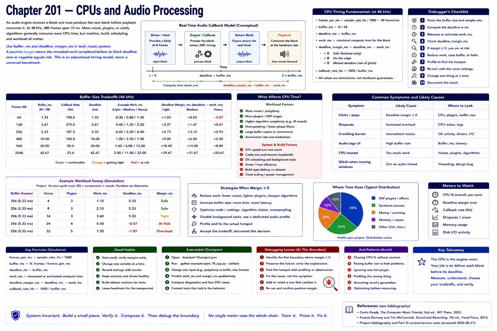

# Chapter 201 — CPUs and Audio Processing

> **Status:** reviewed educational model. Hardware behavior is not probed.

An audio engine receives a block and must produce the next block before playback consumes it. At 48 kHz, 480 frames span 10 ms. More voices, plugins, or costly algorithms generally consume more CPU time, but machine, build, scheduling, and workload all matter.

Use `buffer_ms` and `deadline_margin_ms` in `tech_music.system`. A positive margin means the *simulated* work completed before its block deadline; zero or negative signals risk. This is an educational timing model, never a universal benchmark.

## Checkpoint

Draw the relevant path, label every edge by type, and name one observable at each boundary. Connect the result to Parts IV–X rather than treating this layer in isolation.

## References

- Curtis Roads, *The Computer Music Tutorial*, 2nd ed., MIT Press, 2023 (computer-music systems and terminology).
- Francis Rumsey and Tim McCormick, *Sound and Recording*, 7th ed., Focal Press, 2014 (recording, conversion, monitoring, and acoustics).
- [Project bibliography and Part XI access/version note](../../references/bibliography.md#part-xi-sources), accessed or retrieval attempted 2026-08-21.
