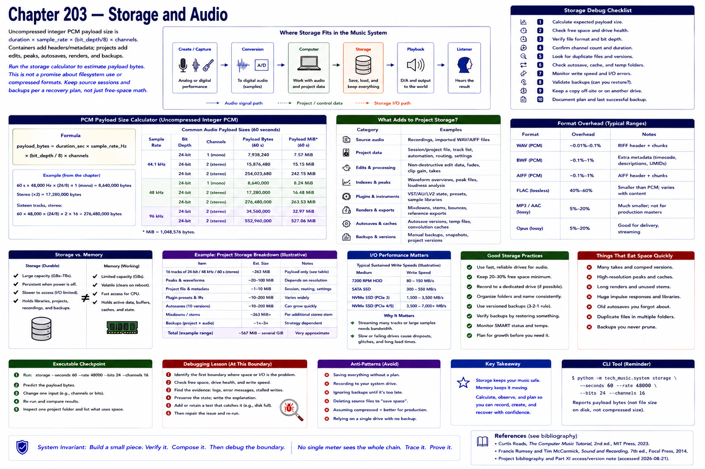

# Chapter 203 — Storage and Audio

> **Status:** reviewed educational model. Hardware behavior is not probed.

Uncompressed integer PCM payload size is `duration × sample_rate × (bit_depth/8) × channels`. Sixty seconds of 48 kHz, 24-bit mono payload is 8,640,000 bytes; stereo doubles it and sixteen tracks multiply it by sixteen. Containers add headers/metadata; edits, peaks, autosaves, renders, and backups add project-level storage.

Run `python -m tech_music.system storage --seconds 60 --rate 48000 --bits 24 --channels 16`. The calculator deliberately reports payload bytes, not a promise about filesystem use or compressed formats. Retain source sessions and backups according to a recovery plan, not merely free-space arithmetic.

## Checkpoint

Draw the relevant path, label every edge by type, and name one observable at each boundary. Connect the result to Parts IV–X rather than treating this layer in isolation.

## References

- Curtis Roads, *The Computer Music Tutorial*, 2nd ed., MIT Press, 2023 (computer-music systems and terminology).
- Francis Rumsey and Tim McCormick, *Sound and Recording*, 7th ed., Focal Press, 2014 (recording, conversion, monitoring, and acoustics).
- [Project bibliography and Part XI access/version note](../../references/bibliography.md#part-xi-sources), accessed or retrieval attempted 2026-08-21.
