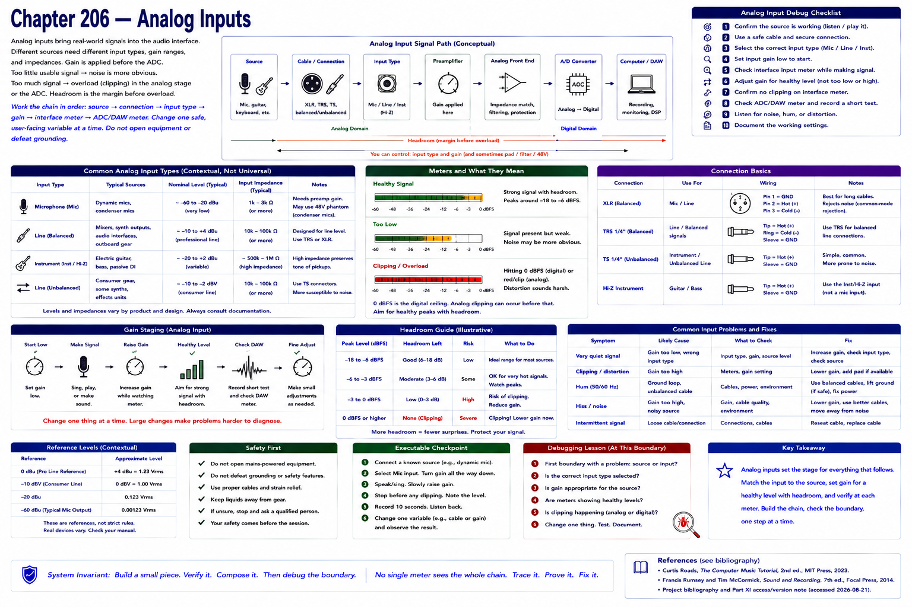

# Chapter 206 — Analog Inputs

> **Status:** reviewed educational model. Hardware behavior is not probed.

Microphone-, line-, and instrument-oriented inputs are designed for different source conditions; their exact levels and impedances are contextual, not universal constants. Gain scales the input before conversion. Too little usable signal can make noise prominent; too much can overload an analog stage or ADC; **headroom** is margin before overload.

For quiet signal, clipping, or noise: confirm source → safe cable/connection → correct input type → input gain → interface meter → ADC/DAW meter. Change one safe, user-facing variable at a time. Never open mains-powered equipment or defeat grounding.

## Checkpoint

Draw the relevant path, label every edge by type, and name one observable at each boundary. Connect the result to Parts IV–X rather than treating this layer in isolation.

## References

- Curtis Roads, *The Computer Music Tutorial*, 2nd ed., MIT Press, 2023 (computer-music systems and terminology).
- Francis Rumsey and Tim McCormick, *Sound and Recording*, 7th ed., Focal Press, 2014 (recording, conversion, monitoring, and acoustics).
- [Project bibliography and Part XI access/version note](../../references/bibliography.md#part-xi-sources), accessed or retrieval attempted 2026-08-21.
