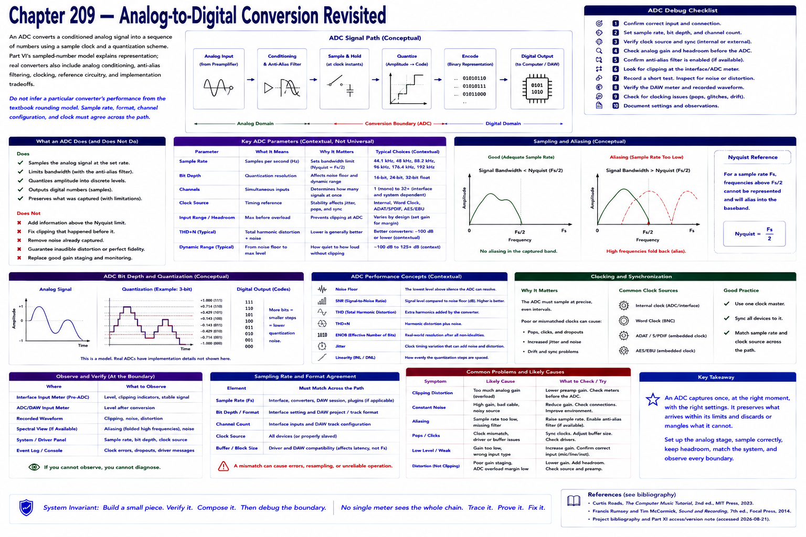

# Chapter 209 — Analog-to-Digital Conversion Revisited



> **Status:** reviewed educational model. Hardware behavior is not probed.

An ADC receives a conditioned analog signal and produces numeric samples using a sample clock and quantization scheme. Part VI's sampled-number model explains representation; real converters additionally include analog conditioning, anti-alias filtering, clocking, reference circuitry, and implementation tradeoffs.

```text
analog input → conditioning/filtering → sample/quantize → digital samples
```
Do not infer a particular converter's performance from the textbook rounding model. Sample rate, format, channel, and clock must agree across the configured path.

## Checkpoint

Draw the relevant path, label every edge by type, and name one observable at each boundary. Connect the result to Parts IV–X rather than treating this layer in isolation.

## References

- Curtis Roads, *The Computer Music Tutorial*, 2nd ed., MIT Press, 2023 (computer-music systems and terminology).
- Francis Rumsey and Tim McCormick, *Sound and Recording*, 7th ed., Focal Press, 2014 (recording, conversion, monitoring, and acoustics).
- [Project bibliography and Part XI access/version note](../../references/bibliography.md#part-xi-sources), accessed or retrieval attempted 2026-08-21.
