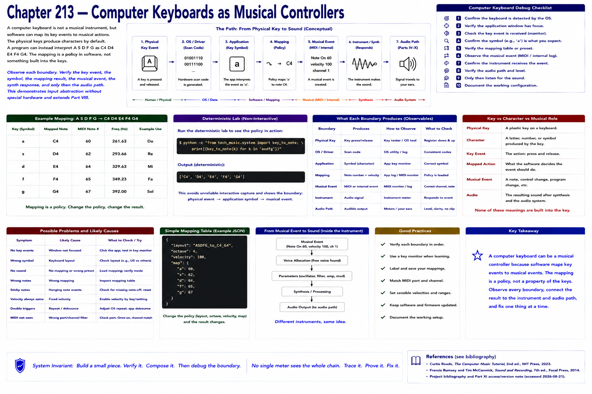

# Chapter 213 — Computer Keyboards as Musical Controllers

> **Status:** reviewed educational model. Hardware behavior is not probed.

An ordinary keyboard demonstrates input abstraction without special hardware: application key events can map `A S D F G` to `C4 D4 E4 F4 G4`. This mapping is a policy, not a physical property of keys.

Run `python -c "from tech_music.system import key_to_note; print([key_to_note(k) for k in 'asdfg'])"`. The deterministic lab avoids unreliable interactive capture and shows the boundary: physical event → application symbol → musical event.

## Checkpoint

Draw the relevant path, label every edge by type, and name one observable at each boundary. Connect the result to Parts IV–X rather than treating this layer in isolation.

## References

- Curtis Roads, *The Computer Music Tutorial*, 2nd ed., MIT Press, 2023 (computer-music systems and terminology).
- Francis Rumsey and Tim McCormick, *Sound and Recording*, 7th ed., Focal Press, 2014 (recording, conversion, monitoring, and acoustics).
- [Project bibliography and Part XI access/version note](../../references/bibliography.md#part-xi-sources), accessed or retrieval attempted 2026-08-21.
