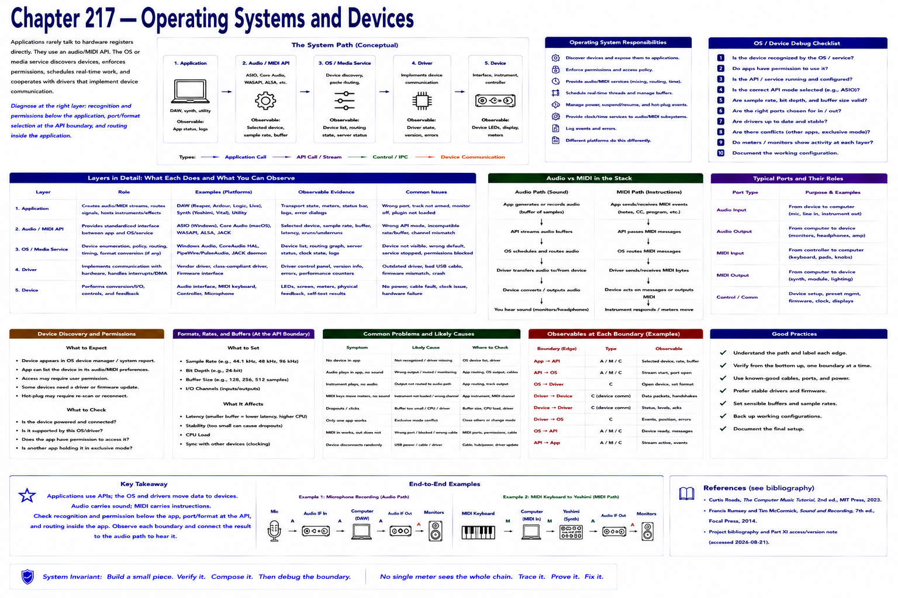
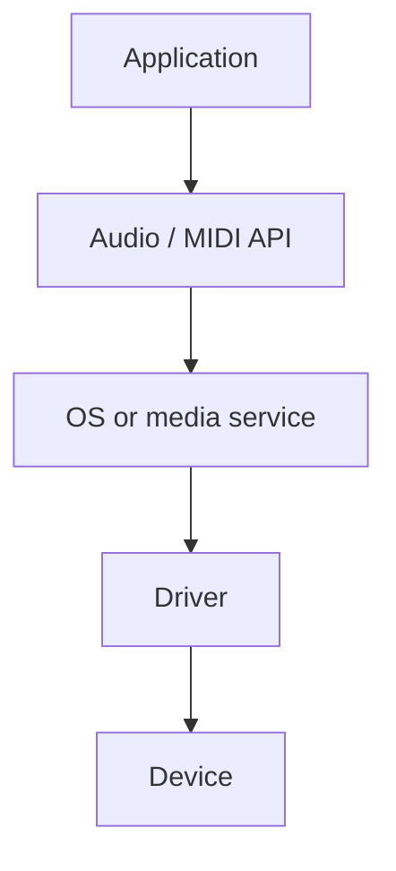

# Chapter 217 — Operating Systems and Devices

> **Status:** reviewed educational model. Hardware behavior is not probed.

Applications usually use an audio/MIDI API rather than manipulating hardware registers. The OS and services discover devices, enforce permissions, schedule work, and cooperate with drivers that implement device communication.

Actual platforms differ. Diagnose recognition and permissions below the application, port/format selection at the API boundary, and routing inside the application.

## Checkpoint

Draw the relevant path, label every edge by type, and name one observable at each boundary. Connect the result to Parts IV–X rather than treating this layer in isolation.

## References

- Curtis Roads, *The Computer Music Tutorial*, 2nd ed., MIT Press, 2023 (computer-music systems and terminology).
- Francis Rumsey and Tim McCormick, *Sound and Recording*, 7th ed., Focal Press, 2014 (recording, conversion, monitoring, and acoustics).
- [Project bibliography and Part XI access/version note](../../references/bibliography.md#part-xi-sources), accessed or retrieval attempted 2026-08-21.
