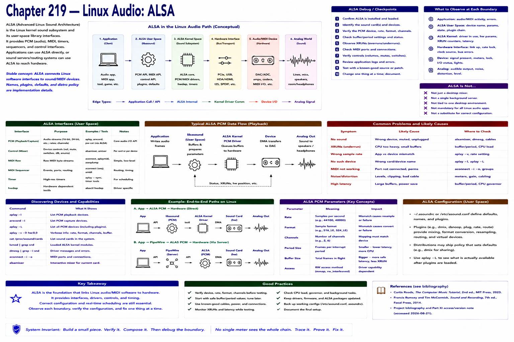

# Chapter 219 — Linux Audio: ALSA

> **Status:** reviewed educational model. Hardware behavior is not probed.

ALSA supplies Linux kernel sound drivers and user-space library interfaces, including PCM and MIDI-related interfaces. Applications can use ALSA interfaces directly, while sound servers and routing systems may also use ALSA to reach hardware. ALSA is therefore not simply a desktop mixer or a single background server.

Stable concept: ALSA connects Linux software interfaces to sound/MIDI devices. Current device names, plugins, defaults, and distribution policy are implementation/configuration details. Official ALSA PCM documentation was selected; remote revalidation was blocked on 2026-08-21.

## Checkpoint

Draw the relevant path, label every edge by type, and name one observable at each boundary. Connect the result to Parts IV–X rather than treating this layer in isolation.

## References

- Curtis Roads, *The Computer Music Tutorial*, 2nd ed., MIT Press, 2023 (computer-music systems and terminology).
- Francis Rumsey and Tim McCormick, *Sound and Recording*, 7th ed., Focal Press, 2014 (recording, conversion, monitoring, and acoustics).
- [Project bibliography and Part XI access/version note](../../references/bibliography.md#part-xi-sources), accessed or retrieval attempted 2026-08-21.
