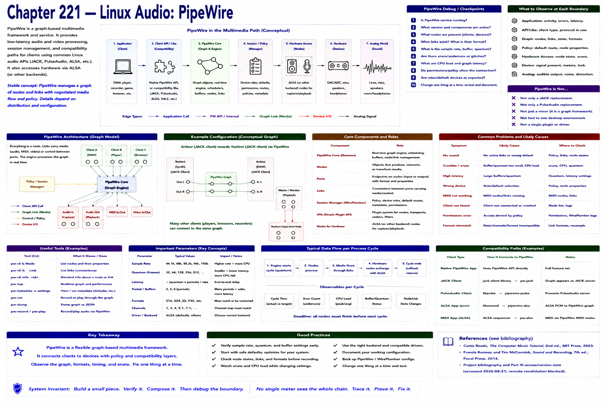

# Chapter 221 — Linux Audio: PipeWire

> **Status:** reviewed educational model. Hardware behavior is not probed.

PipeWire is a graph-based multimedia framework/service used for audio and video on Linux. It can provide compatibility/integration paths for applications using common Linux audio APIs, including JACK- and PulseAudio-oriented clients, depending on installed components and configuration.

Do not reduce it to “a JACK replacement”: native graph facilities, session policy, compatibility libraries, ALSA hardware access, and application APIs are distinct roles. Stable concept: graph objects and negotiated media flow. Current policy, commands, and packaged versions remain distribution-specific. Official overview access was attempted 2026-08-21 and blocked.

## Checkpoint

Draw the relevant path, label every edge by type, and name one observable at each boundary. Connect the result to Parts IV–X rather than treating this layer in isolation.

## References

- Curtis Roads, *The Computer Music Tutorial*, 2nd ed., MIT Press, 2023 (computer-music systems and terminology).
- Francis Rumsey and Tim McCormick, *Sound and Recording*, 7th ed., Focal Press, 2014 (recording, conversion, monitoring, and acoustics).
- [Project bibliography and Part XI access/version note](../../references/bibliography.md#part-xi-sources), accessed or retrieval attempted 2026-08-21.
