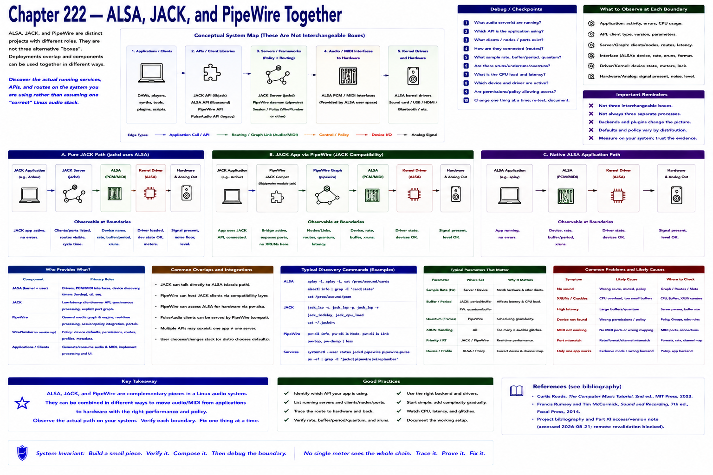

# Chapter 222 — ALSA, JACK, and PipeWire Together



> **Status:** reviewed educational model. Hardware behavior is not probed.

These names do not denote three interchangeable boxes. ALSA commonly supplies kernel drivers and PCM/MIDI interfaces. JACK defines a low-latency client/server API and routing model. PipeWire supplies a general media graph and can host compatibility paths. Deployments overlap.

```text
JACK application → JACK server → ALSA → hardware
JACK application → PipeWire JACK compatibility → PipeWire graph → ALSA → hardware
ALSA application ─────────────────────────────────────────────→ ALSA → hardware
```
Representative only: discover the actual running services and routes rather than assuming one “correct” Linux stack.

## Checkpoint

Draw the relevant path, label every edge by type, and name one observable at each boundary. Connect the result to Parts IV–X rather than treating this layer in isolation.

## References

- Curtis Roads, *The Computer Music Tutorial*, 2nd ed., MIT Press, 2023 (computer-music systems and terminology).
- Francis Rumsey and Tim McCormick, *Sound and Recording*, 7th ed., Focal Press, 2014 (recording, conversion, monitoring, and acoustics).
- [Project bibliography and Part XI access/version note](../../references/bibliography.md#part-xi-sources), accessed or retrieval attempted 2026-08-21.
