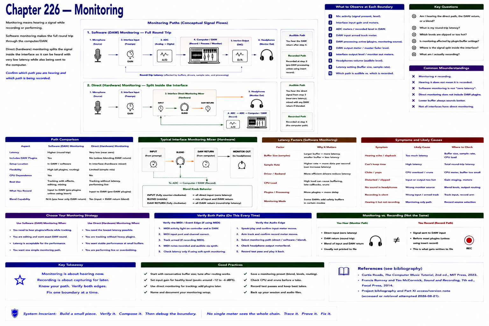

# Chapter 226 — Monitoring



> **Status:** reviewed educational model. Hardware behavior is not probed.

Monitoring means hearing a signal while recording or performing. Software monitoring makes the round trip `mic → interface/ADC → computer/DAW → interface/DAC → headphones`; its buffers and processing affect latency. Direct/hardware monitoring may split within an interface toward headphones while also sending input to the computer.

```text
software: mic → interface → computer → DAW → interface → headphones
direct:   mic → interface ┬→ computer
                          └→ headphones
```
Implementation and blend controls vary. Confirm which path is audible and which path is recorded.

## Checkpoint

Draw the relevant path, label every edge by type, and name one observable at each boundary. Connect the result to Parts IV–X rather than treating this layer in isolation.

## References

- Curtis Roads, *The Computer Music Tutorial*, 2nd ed., MIT Press, 2023 (computer-music systems and terminology).
- Francis Rumsey and Tim McCormick, *Sound and Recording*, 7th ed., Focal Press, 2014 (recording, conversion, monitoring, and acoustics).
- [Project bibliography and Part XI access/version note](../../references/bibliography.md#part-xi-sources), accessed or retrieval attempted 2026-08-21.
