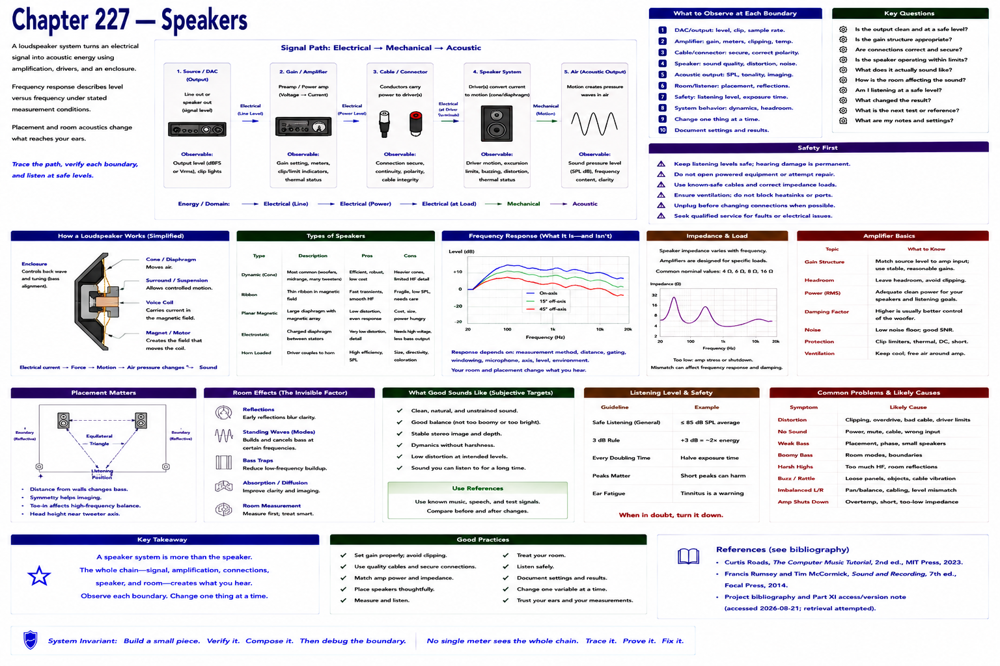

# Chapter 227 — Speakers

> **Status:** reviewed educational model. Hardware behavior is not probed.

A loudspeaker system uses amplification and one or more drivers in an enclosure to turn an electrical signal into acoustic energy. Frequency response describes level versus frequency under stated measurement conditions; placement and room alter what reaches the listener.

Trace DAC/output → gain/amplifier → cable → speaker → air. Keep listening levels safe. Do not open powered equipment or attempt electrical repair; substitute known-safe connections and seek qualified service.

## Checkpoint

Draw the relevant path, label every edge by type, and name one observable at each boundary. Connect the result to Parts IV–X rather than treating this layer in isolation.

## References

- Curtis Roads, *The Computer Music Tutorial*, 2nd ed., MIT Press, 2023 (computer-music systems and terminology).
- Francis Rumsey and Tim McCormick, *Sound and Recording*, 7th ed., Focal Press, 2014 (recording, conversion, monitoring, and acoustics).
- [Project bibliography and Part XI access/version note](../../references/bibliography.md#part-xi-sources), accessed or retrieval attempted 2026-08-21.
