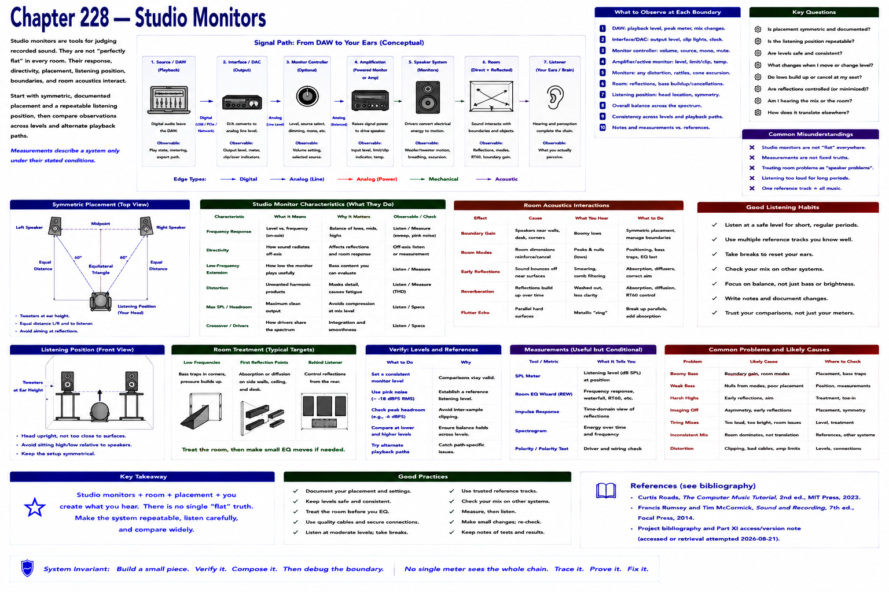

# Chapter 228 — Studio Monitors

> **Status:** reviewed educational model. Hardware behavior is not probed.

Production monitors are used to judge recorded sound; they are not “perfectly flat” in every room. Their response, directivity, placement, listening position, boundaries, and room reflections interact.

Begin with symmetric, documented placement and a repeatable listening position, then compare observations across levels and alternate playback paths. This is functional design, not a product ranking. Measurements describe a system only under their stated conditions.

## Checkpoint

Draw the relevant path, label every edge by type, and name one observable at each boundary. Connect the result to Parts IV–X rather than treating this layer in isolation.

## References

- Curtis Roads, *The Computer Music Tutorial*, 2nd ed., MIT Press, 2023 (computer-music systems and terminology).
- Francis Rumsey and Tim McCormick, *Sound and Recording*, 7th ed., Focal Press, 2014 (recording, conversion, monitoring, and acoustics).
- [Project bibliography and Part XI access/version note](../../references/bibliography.md#part-xi-sources), accessed or retrieval attempted 2026-08-21.
