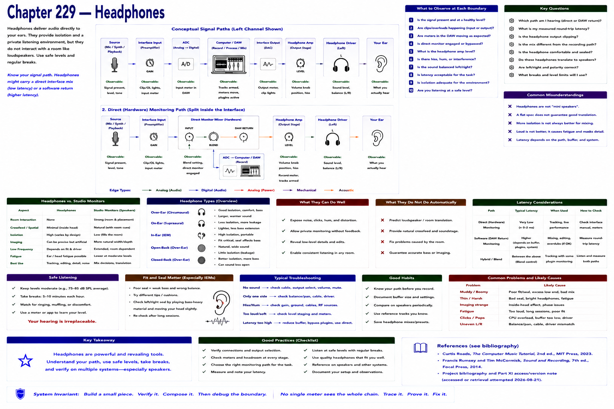

# Chapter 229 — Headphones

> **Status:** reviewed educational model. Hardware behavior is not probed.

Headphones offer isolation, portability, and a direct left/right presentation without the same loudspeaker-room path. They also differ from speakers in spatial presentation, fit, leakage/isolation, and listener-specific response.

They can expose noise and permit monitoring without acoustic feedback, but do not automatically predict loudspeaker translation. Use safe levels and breaks. For latency debugging, determine whether headphones carry a direct interface mix or a software return.

## Checkpoint

Draw the relevant path, label every edge by type, and name one observable at each boundary. Connect the result to Parts IV–X rather than treating this layer in isolation.

## References

- Curtis Roads, *The Computer Music Tutorial*, 2nd ed., MIT Press, 2023 (computer-music systems and terminology).
- Francis Rumsey and Tim McCormick, *Sound and Recording*, 7th ed., Focal Press, 2014 (recording, conversion, monitoring, and acoustics).
- [Project bibliography and Part XI access/version note](../../references/bibliography.md#part-xi-sources), accessed or retrieval attempted 2026-08-21.
