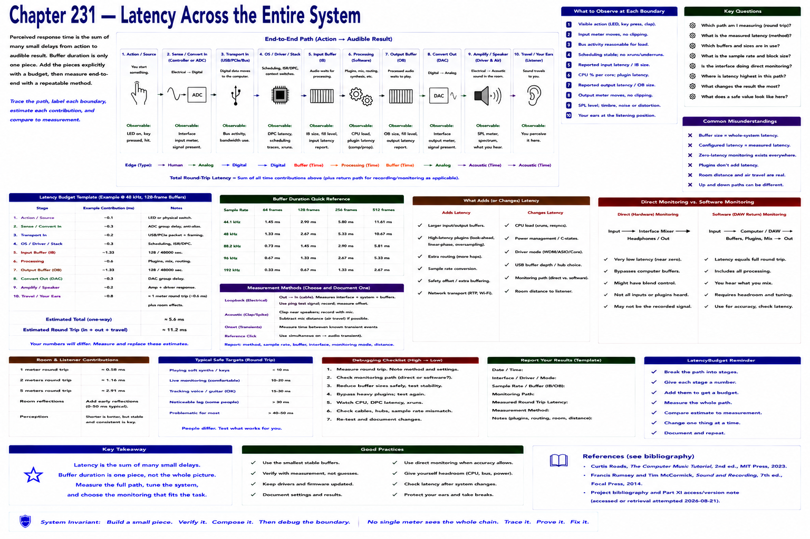

# Chapter 231 — Latency Across the Entire System



> **Status:** reviewed educational model. Hardware behavior is not probed.

Perceived response time can accumulate through sensing/conversion, transport, OS/driver scheduling, input buffering, software processing, output buffering, conversion, and acoustic travel. Buffer duration is `frames / sample_rate`; it is one contribution, not the entire round trip.

```text
action → controller/ADC → transport → OS/driver → input buffer → processing → output buffer → DAC → speaker → listener
```
Use `LatencyBudget` to add explicitly labeled *estimates*. Report measurement method separately; do not equate a configured buffer with measured end-to-end latency.

## Checkpoint

Draw the relevant path, label every edge by type, and name one observable at each boundary. Connect the result to Parts IV–X rather than treating this layer in isolation.

## References

- Curtis Roads, *The Computer Music Tutorial*, 2nd ed., MIT Press, 2023 (computer-music systems and terminology).
- Francis Rumsey and Tim McCormick, *Sound and Recording*, 7th ed., Focal Press, 2014 (recording, conversion, monitoring, and acoustics).
- [Project bibliography and Part XI access/version note](../../references/bibliography.md#part-xi-sources), accessed or retrieval attempted 2026-08-21.
