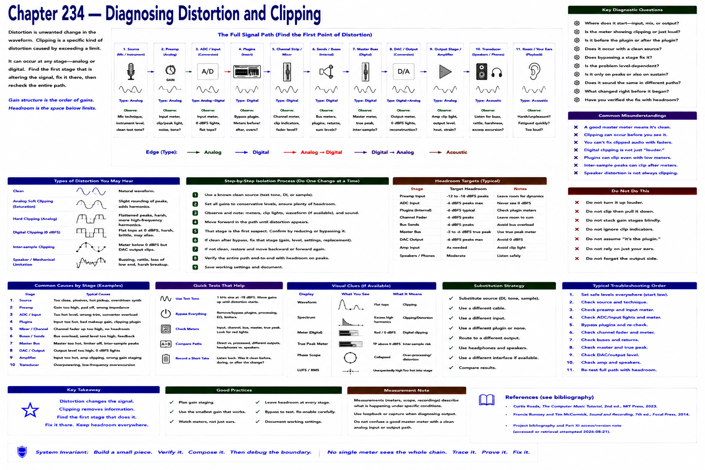

# Chapter 234 — Diagnosing Distortion and Clipping

> **Status:** reviewed educational model. Hardware behavior is not probed.

Distortion can originate at source/microphone, preamp, ADC, plugin, mixer, master, DAC/output, amplifier, or transducer. A clean DAW master meter does not prove the analog input or output stages are clean.

Reduce or bypass one stage, observe before and after it, and substitute a known clean source/path. Keep headroom at each boundary. Do not compensate for a clipped preamp with a later fader: clipped information is already altered.

## Checkpoint

Draw the relevant path, label every edge by type, and name one observable at each boundary. Connect the result to Parts IV–X rather than treating this layer in isolation.

## References

- Curtis Roads, *The Computer Music Tutorial*, 2nd ed., MIT Press, 2023 (computer-music systems and terminology).
- Francis Rumsey and Tim McCormick, *Sound and Recording*, 7th ed., Focal Press, 2014 (recording, conversion, monitoring, and acoustics).
- [Project bibliography and Part XI access/version note](../../references/bibliography.md#part-xi-sources), accessed or retrieval attempted 2026-08-21.
