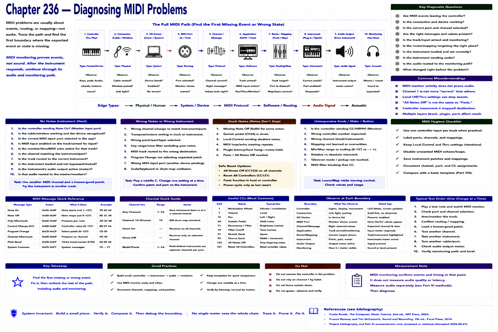

# Chapter 236 — Diagnosing MIDI Problems

> **Status:** reviewed educational model. Hardware behavior is not probed.

Trace controller → connection → OS device → MIDI port → channel/message → application → route/mapping → instrument. For no notes, find the first missing event. For wrong notes/instrument, inspect mapping, transpose, channel, patch/part. For stuck notes, observe note-on/note-off pairing and reset safely. For an unresponsive knob, inspect controller number/value and mapping.

MIDI monitoring proves events, not audio. After the instrument responds, continue through its audio output and monitoring route. Compare against the deterministic Part VIII models before blaming hardware.

## Checkpoint

Draw the relevant path, label every edge by type, and name one observable at each boundary. Connect the result to Parts IV–X rather than treating this layer in isolation.

## References

- Curtis Roads, *The Computer Music Tutorial*, 2nd ed., MIT Press, 2023 (computer-music systems and terminology).
- Francis Rumsey and Tim McCormick, *Sound and Recording*, 7th ed., Focal Press, 2014 (recording, conversion, monitoring, and acoustics).
- [Project bibliography and Part XI access/version note](../../references/bibliography.md#part-xi-sources), accessed or retrieval attempted 2026-08-21.
