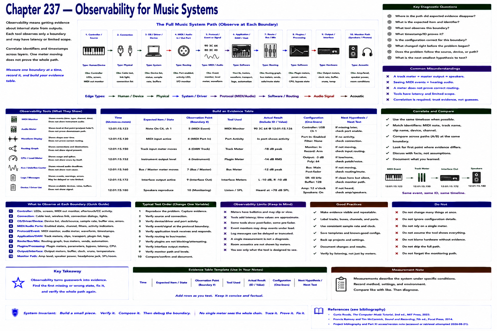

# Chapter 237 — Observability for Music Systems

> **Status:** reviewed educational model. Hardware behavior is not probed.

Observability means obtaining evidence about internal state from outputs such as MIDI event monitors, audio meters, waveforms, routing graphs, CPU/load meters, xrun counters, logs, and device lists. Each observes only a boundary and may itself have latency or limited scope.

Build an evidence table: time, expected item, observation point, actual result, configuration, and next hypothesis. Correlate identifiers and timestamps across layers. A meter moving on one track does not prove the master, device, or speaker path.

## Checkpoint

Draw the relevant path, label every edge by type, and name one observable at each boundary. Connect the result to Parts IV–X rather than treating this layer in isolation.

## References

- Curtis Roads, *The Computer Music Tutorial*, 2nd ed., MIT Press, 2023 (computer-music systems and terminology).
- Francis Rumsey and Tim McCormick, *Sound and Recording*, 7th ed., Focal Press, 2014 (recording, conversion, monitoring, and acoustics).
- [Project bibliography and Part XI access/version note](../../references/bibliography.md#part-xi-sources), accessed or retrieval attempted 2026-08-21.
