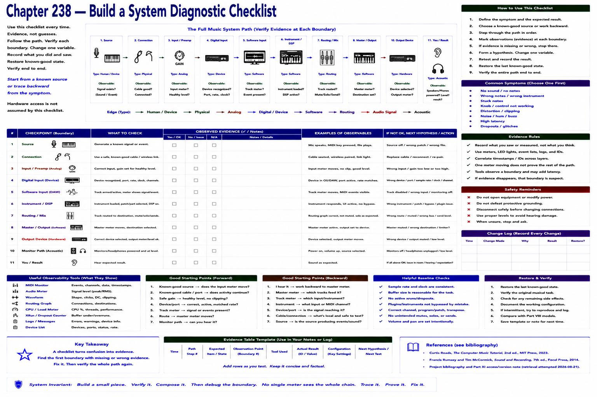

# Chapter 238 — Build a System Diagnostic Checklist

> **Status:** reviewed educational model. Hardware behavior is not probed.

Use a reusable checklist rather than memory. **Input:** source, safe cable, correct input, gain. **Digital input:** device recognized, port, sample rate/clock, channel. **Software:** track/event meter, instrument, DSP, route, mute/solo. **Output:** master meter/destination, selected device, interface output, headphones/monitors.

Mark observed evidence, not guesses. Start from a known source or trace backward from the symptom. Record changes, change one variable, restore known-good state, and verify end to end. Hardware access is not assumed by this checklist.

## Checkpoint

Draw the relevant path, label every edge by type, and name one observable at each boundary. Connect the result to Parts IV–X rather than treating this layer in isolation.

## References

- Curtis Roads, *The Computer Music Tutorial*, 2nd ed., MIT Press, 2023 (computer-music systems and terminology).
- Francis Rumsey and Tim McCormick, *Sound and Recording*, 7th ed., Focal Press, 2014 (recording, conversion, monitoring, and acoustics).
- [Project bibliography and Part XI access/version note](../../references/bibliography.md#part-xi-sources), accessed or retrieval attempted 2026-08-21.
