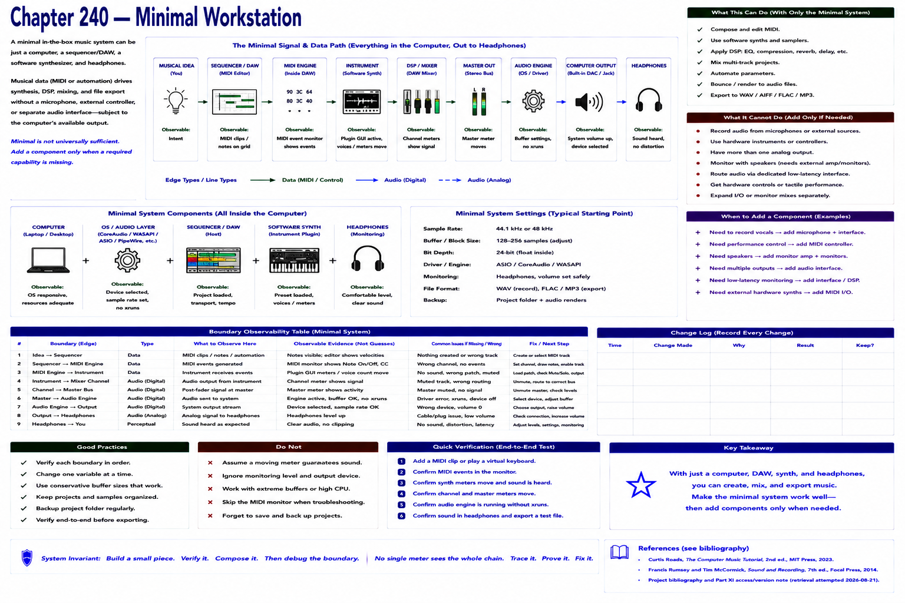

# Chapter 240 — Minimal Workstation

> **Status:** reviewed educational model. Hardware behavior is not probed.

A small in-the-box system can be computer + sequencer/DAW + software synthesizer + headphones. Musical data drives synthesis, DSP, mixing, and file export without a microphone, external controller, or separate interface (subject to the computer's available output).

Minimal does not mean universally sufficient. Add a component only when a required capability is absent. This reinforces the book's premise: substantial digital music can be created primarily through software.

## Checkpoint

Draw the relevant path, label every edge by type, and name one observable at each boundary. Connect the result to Parts IV–X rather than treating this layer in isolation.

## References

- Curtis Roads, *The Computer Music Tutorial*, 2nd ed., MIT Press, 2023 (computer-music systems and terminology).
- Francis Rumsey and Tim McCormick, *Sound and Recording*, 7th ed., Focal Press, 2014 (recording, conversion, monitoring, and acoustics).
- [Project bibliography and Part XI access/version note](../../references/bibliography.md#part-xi-sources), accessed or retrieval attempted 2026-08-21.
