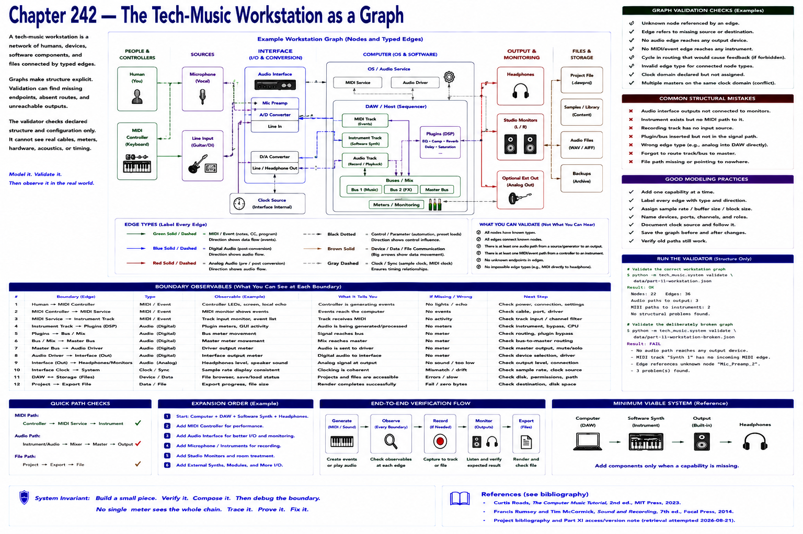

# Chapter 242 — The Tech-Music Workstation as a Graph

> **Status:** reviewed educational model. Hardware behavior is not probed.

Model humans, controllers, microphones, interfaces, OS services, synths, DAW tracks/plugins/buses, output devices, and files as nodes. Typed edges distinguish audio, MIDI/event, control, and device communication. Graph validation can find unknown endpoints, absent event/audio routes, or no audio edge reaching an output.

Run `python -m tech_music.system validate data/part-11-workstation.json`, then the deliberately broken file. The validator checks declared structure and configuration only; it cannot see real cables, meters, hardware, acoustics, or timing.

## Checkpoint

Draw the relevant path, label every edge by type, and name one observable at each boundary. Connect the result to Parts IV–X rather than treating this layer in isolation.

## References

- Curtis Roads, *The Computer Music Tutorial*, 2nd ed., MIT Press, 2023 (computer-music systems and terminology).
- Francis Rumsey and Tim McCormick, *Sound and Recording*, 7th ed., Focal Press, 2014 (recording, conversion, monitoring, and acoustics).
- [Project bibliography and Part XI access/version note](../../references/bibliography.md#part-xi-sources), accessed or retrieval attempted 2026-08-21.
