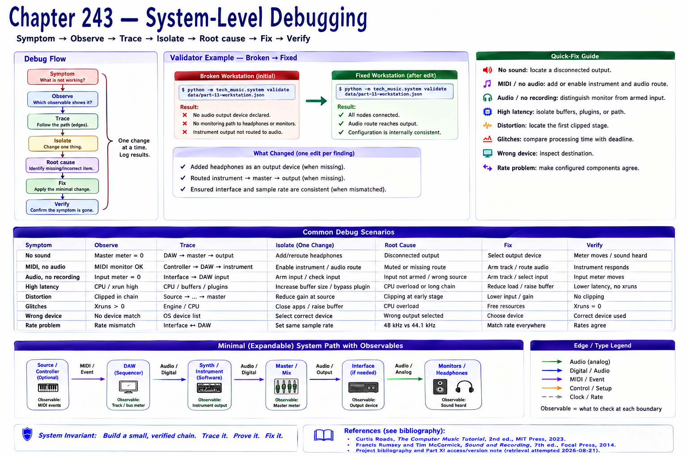

# Chapter 243 — System-Level Debugging

> **Status:** reviewed educational model. Hardware behavior is not probed.

Use **Symptom → Observe → Trace → Isolate → Root cause → Fix → Verify**. No sound: locate a disconnected output. MIDI/no audio: add/enable instrument and audio route. Audio/no recording: distinguish monitor from armed input. High latency: isolate buffers/plugins/path. Distortion: locate the first clipped stage. Glitches: compare processing time with deadline. Wrong device: inspect destination. Rate problem: make configured components agree.

Run the broken workstation validator, make one edit per finding, and rerun. A validator finding is a hypothesis about declared configuration, not a hardware diagnosis. Preserve logs/configs so the final verification tests the original symptom and avoids accidental changes elsewhere.

## Checkpoint

Draw the relevant path, label every edge by type, and name one observable at each boundary. Connect the result to Parts IV–X rather than treating this layer in isolation.

## References

- Curtis Roads, *The Computer Music Tutorial*, 2nd ed., MIT Press, 2023 (computer-music systems and terminology).
- Francis Rumsey and Tim McCormick, *Sound and Recording*, 7th ed., Focal Press, 2014 (recording, conversion, monitoring, and acoustics).
- [Project bibliography and Part XI access/version note](../../references/bibliography.md#part-xi-sources), accessed or retrieval attempted 2026-08-21.
