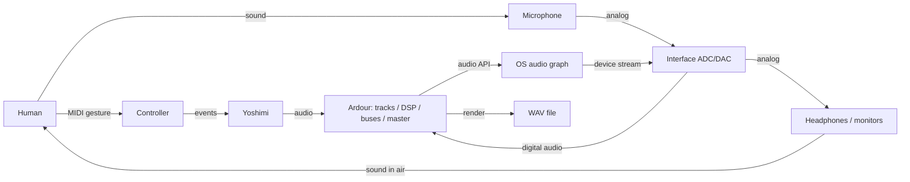

# Part XI Capstone — Design and Trace a Complete Tech-Music System

> **Status:** executable architectural capstone; no physical hardware was available or tested.

The design joins performer, controller, microphone, interface/ADC/DAC, computer, OS audio layer, Yoshimi, Ardour, plugins, routing, and headphones/monitors. Every arrow is a contract and an observation point.



## Three complete paths

1. **Software instrument:** human → MIDI controller → computer/OS port → Yoshimi → Ardour DSP/mix → audio system → interface/DAC → headphones.
2. **Recorded voice/instrument:** source → microphone → preamp/ADC in interface → OS → Ardour → DSP/mix → audio system → DAC → monitors.
3. **Fully in the box:** sequenced musical data → synth → DSP → mixer → WAV. This path ends in durable digital data; playback later adds DAC, monitoring, room, and listener.

## Diagnostic simulation

`data/part-11-workstation.json` declares a working event/audio route. `data/part-11-broken-workstation.json` deliberately omits MIDI and output routes, mutes the master, and disagrees on sample rate.

```bash
python -m tech_music.system validate data/part-11-workstation.json
python -m tech_music.system validate data/part-11-broken-workstation.json
```

The second command exits nonzero and reports structural findings. The validator cannot observe hardware, electrical levels, real latency, or room acoustics. Repair one declared fault at a time and verify the whole path.

## End-of-part model

Human action → physical device → event or analog signal → digital representation → OS → software → synthesis/DSP/mixing → digital audio → conversion → physical sound → hearing. When failure occurs, ask: **at what boundary did the expected signal, event, data, state, or deadline disappear?** Part XII already exists in the book plan; this part does not add to or redefine it.

## References

- Curtis Roads, *The Computer Music Tutorial*, 2nd ed., MIT Press, 2023 (computer-music systems and terminology).
- Francis Rumsey and Tim McCormick, *Sound and Recording*, 7th ed., Focal Press, 2014 (recording, conversion, monitoring, and acoustics).
- [Project bibliography and Part XI access/version note](../../references/bibliography.md#part-xi-sources), accessed or retrieval attempted 2026-08-21.
