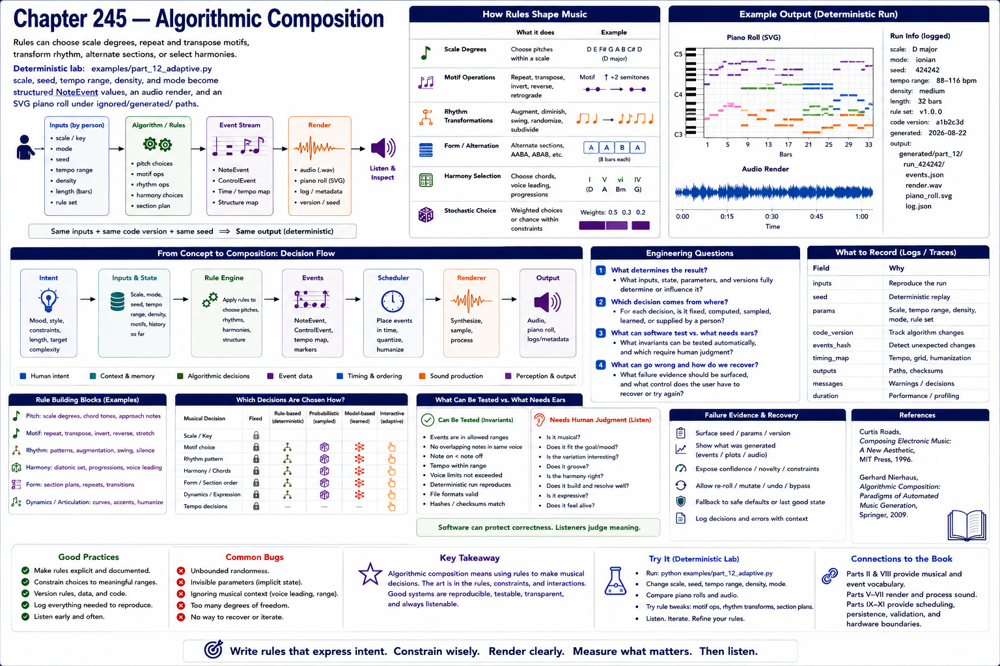

# Chapter 245 — Algorithmic Composition

## Model

Rules can choose scale degrees, repeat and transpose motifs, transform rhythm, alternate sections, or select harmonies. The deterministic lab is `examples/part_12_adaptive.py`: scale, seed, tempo range, density, and mode become structured `NoteEvent` values, an audio render, and an SVG piano roll under ignored `generated/` paths.

## Engineering questions

- What inputs, state, parameters, and versions determine the result?
- Which decision is fixed, sampled, learned, or left to a person?
- What invariant can software test, and what judgment requires a listener?
- What failure evidence and recovery control should the interface expose?

## Connection to the book

Parts II and VIII supply musical/event vocabulary; Parts V–VII render and process sound; Parts IX–XI supply scheduling, persistence, validation, and hardware boundaries.

## References

- [Roads 1996](../../references/bibliography.md#part-xii-sources); [Nierhaus 2009](../../references/bibliography.md#part-xii-sources).
