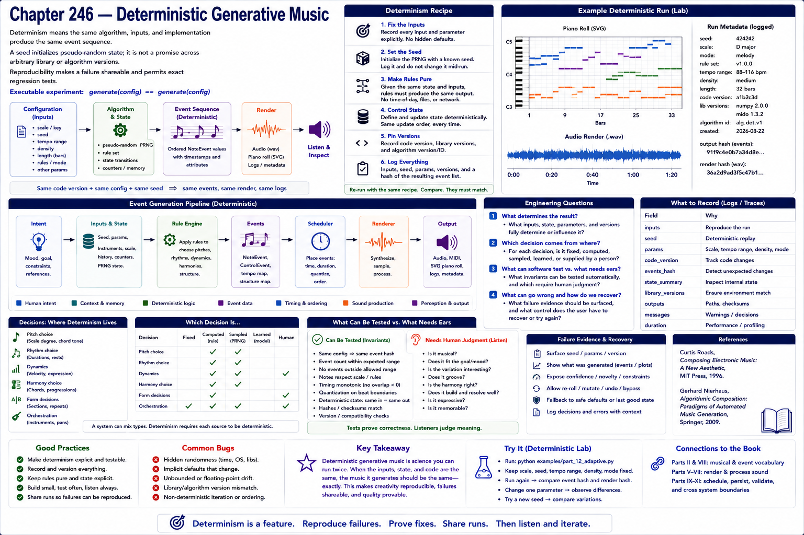

# Chapter 246 — Deterministic Generative Music

## Model

Determinism means the same algorithm, inputs, and implementation produce the same event sequence. A seed initializes pseudo-random state; it is not a promise across arbitrary library or algorithm versions. Reproducibility makes a failure shareable and permits exact regression tests. `generate(config) == generate(config)` is the executable experiment.

## Engineering questions

- What inputs, state, parameters, and versions determine the result?
- Which decision is fixed, sampled, learned, or left to a person?
- What invariant can software test, and what judgment requires a listener?
- What failure evidence and recovery control should the interface expose?

## Connection to the book

Parts II and VIII supply musical/event vocabulary; Parts V–VII render and process sound; Parts IX–XI supply scheduling, persistence, validation, and hardware boundaries.

## References

- [Roads 1996](../../references/bibliography.md#part-xii-sources); [Nierhaus 2009](../../references/bibliography.md#part-xii-sources).
