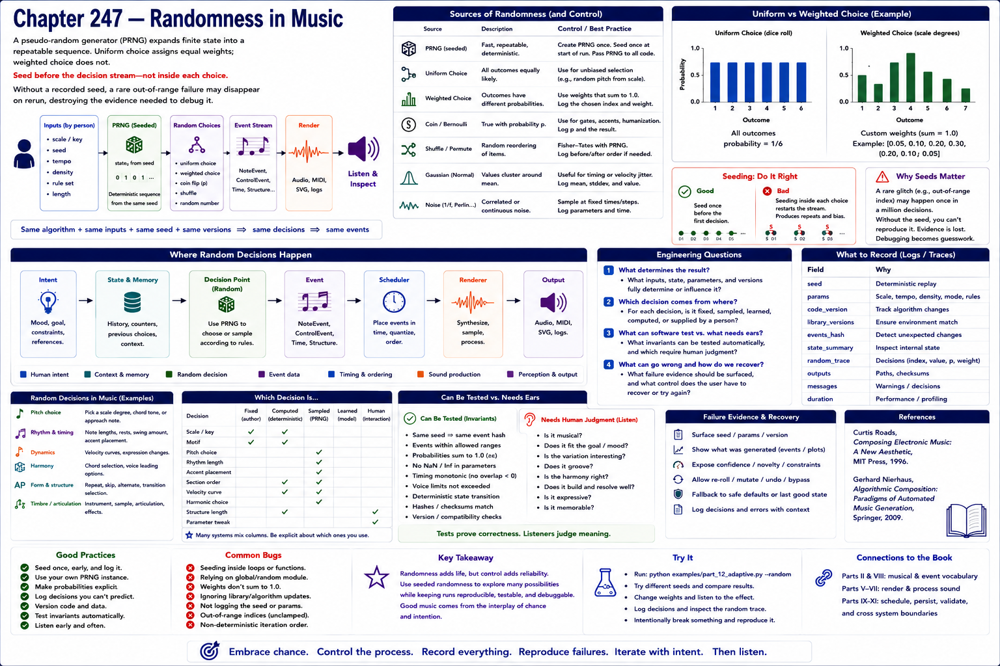

# Chapter 247 — Randomness in Music

## Model

A pseudo-random generator expands finite state into a repeatable sequence. Uniform choice assigns equal weights; weighted choice does not. Seed before the decision stream—not inside each choice. Without a recorded seed, a rare out-of-range failure may disappear on rerun, destroying the evidence needed to debug it.

## Engineering questions

- What inputs, state, parameters, and versions determine the result?
- Which decision is fixed, sampled, learned, or left to a person?
- What invariant can software test, and what judgment requires a listener?
- What failure evidence and recovery control should the interface expose?

## Connection to the book

Parts II and VIII supply musical/event vocabulary; Parts V–VII render and process sound; Parts IX–XI supply scheduling, persistence, validation, and hardware boundaries.

## References

- [Roads 1996](../../references/bibliography.md#part-xii-sources); [Nierhaus 2009](../../references/bibliography.md#part-xii-sources).
