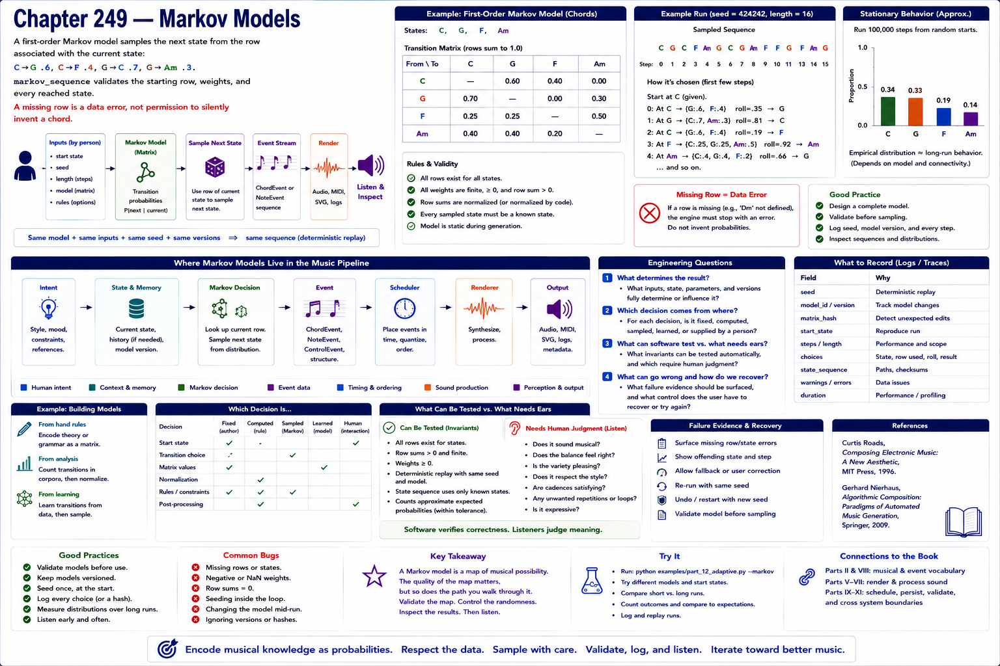

# Chapter 249 — Markov Models

## Model

A first-order Markov model samples the next state from the row associated with the current state: `C→G .6`, `C→F .4`, `G→C .7`, `G→Am .3`. `markov_sequence` validates the starting row, weights, and every reached state. A missing row is a data error, not permission to silently invent a chord.

## Engineering questions

- What inputs, state, parameters, and versions determine the result?
- Which decision is fixed, sampled, learned, or left to a person?
- What invariant can software test, and what judgment requires a listener?
- What failure evidence and recovery control should the interface expose?

## Connection to the book

Parts II and VIII supply musical/event vocabulary; Parts V–VII render and process sound; Parts IX–XI supply scheduling, persistence, validation, and hardware boundaries.

## References

- [Roads 1996](../../references/bibliography.md#part-xii-sources); [Nierhaus 2009](../../references/bibliography.md#part-xii-sources).
