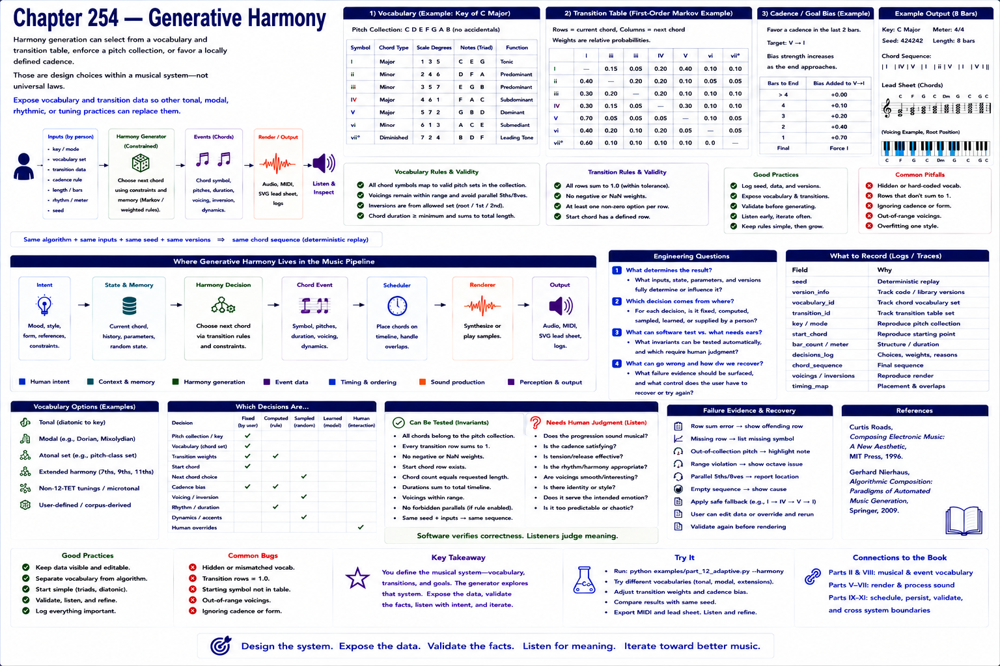

# Chapter 254 — Generative Harmony

## Model

Harmony generation can select from a vocabulary and transition table, enforce a pitch collection, or favor a locally defined cadence. Those are design choices within a musical system—not universal laws. Expose vocabulary and transition data so other tonal, modal, rhythmic, or tuning practices can replace them.

## Engineering questions

- What inputs, state, parameters, and versions determine the result?
- Which decision is fixed, sampled, learned, or left to a person?
- What invariant can software test, and what judgment requires a listener?
- What failure evidence and recovery control should the interface expose?

## Connection to the book

Parts II and VIII supply musical/event vocabulary; Parts V–VII render and process sound; Parts IX–XI supply scheduling, persistence, validation, and hardware boundaries.

## References

- [Roads 1996](../../references/bibliography.md#part-xii-sources); [Nierhaus 2009](../../references/bibliography.md#part-xii-sources).
