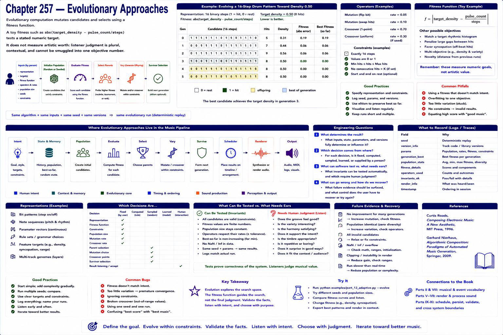

# Chapter 257 — Evolutionary Approaches

## Model

Evolutionary computation mutates candidates and selects using a fitness function. A toy fitness such as `abs(target_density - pulse_count/steps)` tests a stated numeric target. It does **not** measure artistic worth: listener judgment is plural, contextual, and cannot be smuggled into one objective number.

## Engineering questions

- What inputs, state, parameters, and versions determine the result?
- Which decision is fixed, sampled, learned, or left to a person?
- What invariant can software test, and what judgment requires a listener?
- What failure evidence and recovery control should the interface expose?

## Connection to the book

Parts II and VIII supply musical/event vocabulary; Parts V–VII render and process sound; Parts IX–XI supply scheduling, persistence, validation, and hardware boundaries.

## References

- [Roads 1996](../../references/bibliography.md#part-xii-sources); [Nierhaus 2009](../../references/bibliography.md#part-xii-sources).
