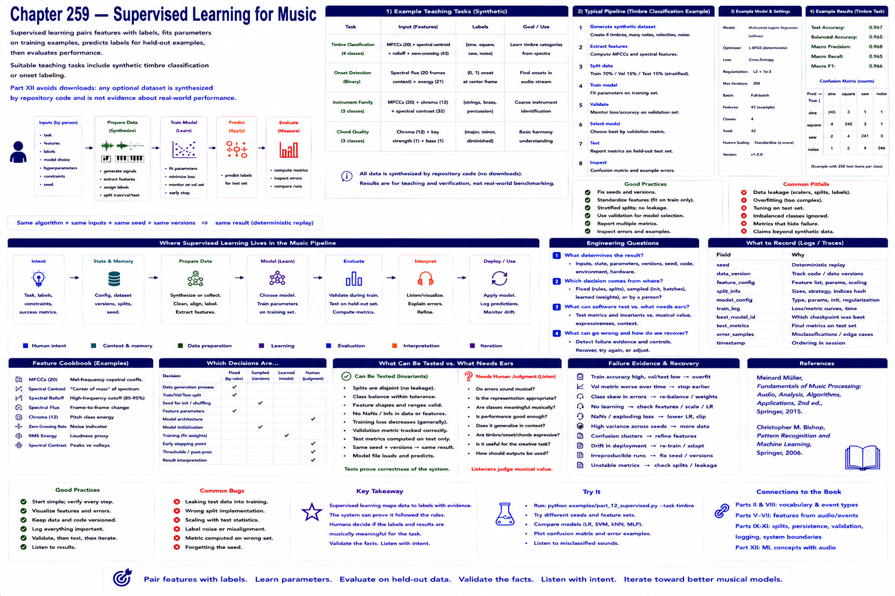

# Chapter 259 — Supervised Learning for Music

## Model

Supervised learning pairs features with labels, fits parameters on training examples, predicts labels for held-out examples, then evaluates. Suitable teaching tasks include synthetic timbre classification or onset labeling. Part XII avoids downloads: any optional dataset is synthesized by repository code and is not evidence about real-world performance.

## Engineering questions

- What inputs, state, parameters, and versions determine the result?
- Which decision is fixed, sampled, learned, or left to a person?
- What invariant can software test, and what judgment requires a listener?
- What failure evidence and recovery control should the interface expose?

## Connection to the book

Parts II and VIII supply musical/event vocabulary; Parts V–VII render and process sound; Parts IX–XI supply scheduling, persistence, validation, and hardware boundaries.

## References

- [Müller 2015](../../references/bibliography.md#part-xii-sources); [Bishop 2006](../../references/bibliography.md#part-xii-sources).
