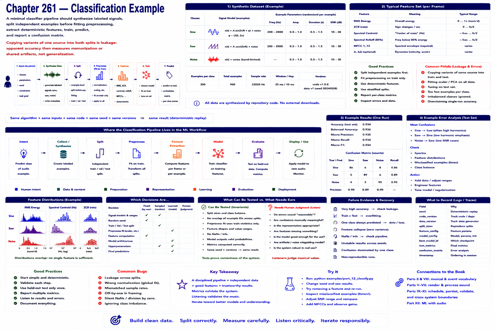

# Chapter 261 — Classification Example

## Model

A minimal classifier pipeline should synthesize labeled signals, split independent examples before fitting preprocessing, extract deterministic features, train, predict, and report a confusion matrix. Copying variants of one source into both splits is leakage: apparent accuracy then measures memorization or shared artifacts, not generalization.

## Engineering questions

- What inputs, state, parameters, and versions determine the result?
- Which decision is fixed, sampled, learned, or left to a person?
- What invariant can software test, and what judgment requires a listener?
- What failure evidence and recovery control should the interface expose?

## Connection to the book

Parts II and VIII supply musical/event vocabulary; Parts V–VII render and process sound; Parts IX–XI supply scheduling, persistence, validation, and hardware boundaries.

## References

- [Müller 2015](../../references/bibliography.md#part-xii-sources); [Bishop 2006](../../references/bibliography.md#part-xii-sources).
