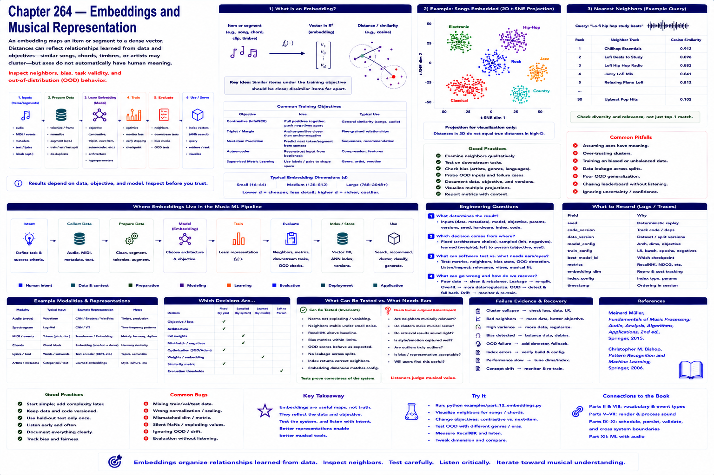

# Chapter 264 — Embeddings and Musical Representation

## Model

An embedding assigns an item or segment a vector. Distance may reflect relationships encouraged by the training objective and corpus—songs, chords, timbres, or artists can cluster—but axes do not automatically have stable human semantics. Inspect neighbors, bias, task validity, and out-of-distribution behavior.

## Engineering questions

- What inputs, state, parameters, and versions determine the result?
- Which decision is fixed, sampled, learned, or left to a person?
- What invariant can software test, and what judgment requires a listener?
- What failure evidence and recovery control should the interface expose?

## Connection to the book

Parts II and VIII supply musical/event vocabulary; Parts V–VII render and process sound; Parts IX–XI supply scheduling, persistence, validation, and hardware boundaries.

## References

- [Müller 2015](../../references/bibliography.md#part-xii-sources); [Bishop 2006](../../references/bibliography.md#part-xii-sources).
