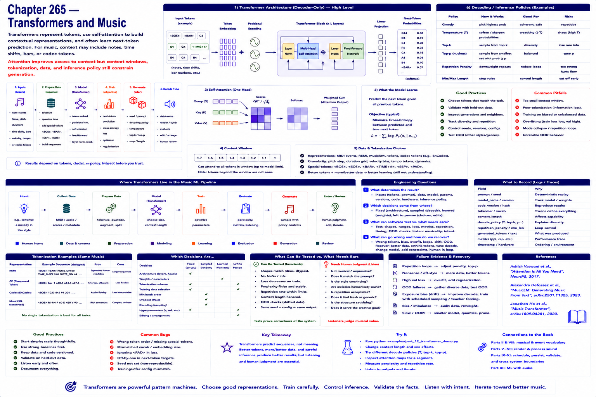

# Chapter 265 — Transformers and Music

## Model

Transformers represent tokens, build contextual representations with attention, and often learn next-token prediction. For music, context may include notes, time shifts, bars, or codec tokens. Attention improves access to context but context windows, tokenization, data, and inference policy still constrain generation.

## Engineering questions

- What inputs, state, parameters, and versions determine the result?
- Which decision is fixed, sampled, learned, or left to a person?
- What invariant can software test, and what judgment requires a listener?
- What failure evidence and recovery control should the interface expose?

## Connection to the book

Parts II and VIII supply musical/event vocabulary; Parts V–VII render and process sound; Parts IX–XI supply scheduling, persistence, validation, and hardware boundaries.

## References

- [Vaswani et al. 2017](../../references/bibliography.md#part-xii-sources); [Copet et al. 2023](../../references/bibliography.md#part-xii-sources); [Ho et al. 2020](../../references/bibliography.md#part-xii-sources).
